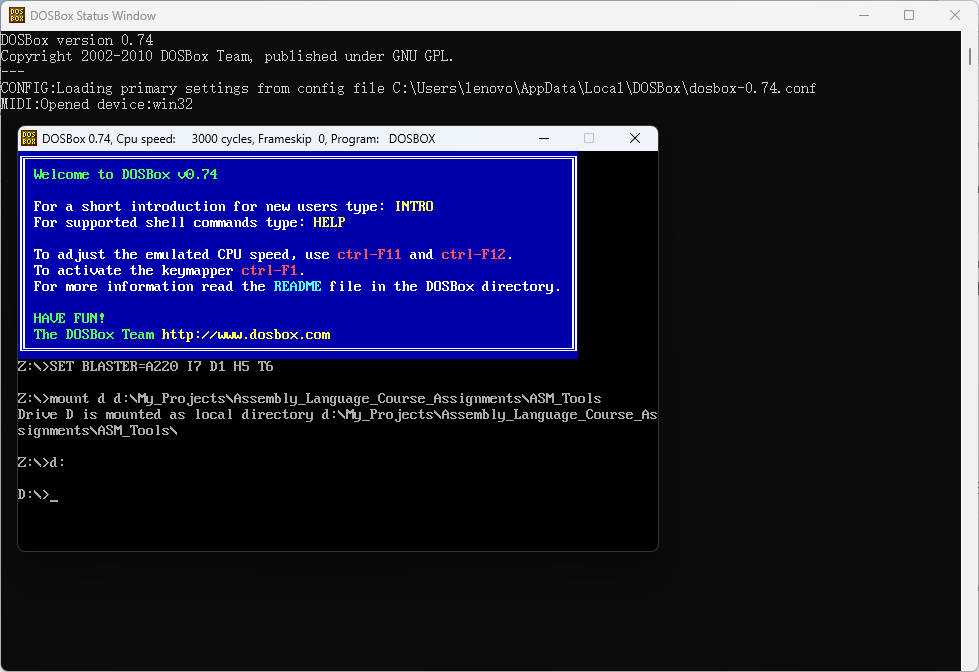
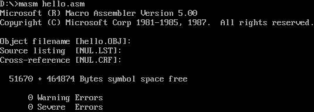
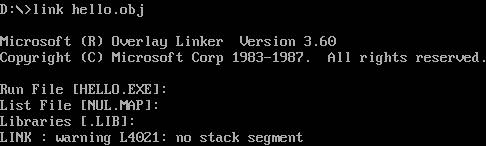
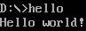
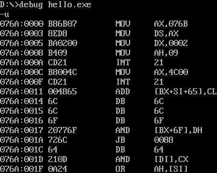
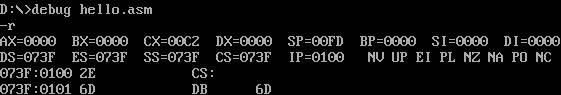
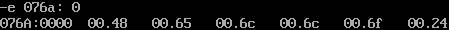
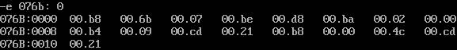
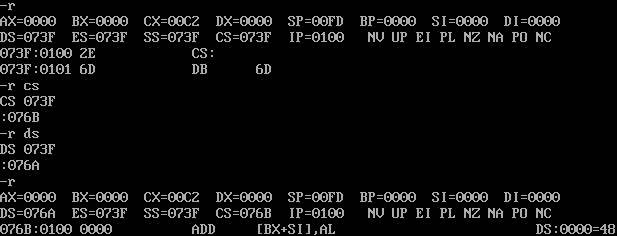

# Assignment 1 Helloworld

## 传统编译方式

### 环境配置

1. 安装 [DOSBox](https://www.dosbox.com)，在 DOSBox 的安装目录下打开 DOSBox 0.74 Options.bat Windows 批处理文件，在打开的 dosbox-0.74.conf 配置文件的末尾添加如下内容，并保存。这些配置使得 DOSBox 启动后，直接挂载并进入 D:\My_Projects\Assembly_Language_Course_Assignments\ASM_Tools 文件夹，方便用户在该目录下执行汇编工具或文件。

```
[autoexec]
# Lines in this section will be run at startup.
# You can put your MOUNT lines here.

mount d d:\My_Projects\Assembly_Language_Course_Assignments\ASM_Tools
d:
```

2. 在 D:\My_Projects\Assembly_Language_Course_Assignments\ASM_Tools 文件夹中添加 DEBUG.EXE、LINK.EXE 和 MASM.EXE。


### 创建汇编文件

在 ASM_Tools 文件夹中创建 HELLO.ASM，汇编文件内容如下：

```
.model small
.data
Hello DB 'Hello world!', 0dh, 0ah, '$'
.code
START:
    MOV AX, @DATA
    MOV DS, AX
    MOV DX, offset Hello
    MOV AH, 9
    INT 21H
    MOV AX, 4C00H
    INT 21h
END START
```

### 编译并运行汇编程序

1. 启动 DOSBox 0.74。



2. 执行命令 `masm hello.asm`，Object filename 选项回车，表示接受默认文件名，Source listing 选项回车，表示不生成源代码列表文件，Cross-reference 回车，表示不生成交叉引用表。这一步的作用是使用编译器将汇编语言的 .asm 源文件编译成一个 .obj 文件，用于后续的链接步骤。



3. 执行命令 `link hello.obj`，Run File 选项回车，表示接受默认文件名，List File 选项回车，表示不生成列表文件，Libraries 选项回车，表示不链接任何额外的库文件，采用默认设置。这一步通过链接器将编译生成的目标文件 hello.obj 链接为可执行文件。



4. 执行命令 `hello`，执行可执行程序。



5. 执行命令 `debug hello.exe`，再使用 `-u` 命令，可以反汇编可执行文件的机器代码，逐条显示汇编指令。



### 反汇编结果分析

1. `076A:0000 BB6B07 MOV AX,076B`

   这条指令将 076B 值加载到 AX 寄存器中。

2. `076A:0003 8EDB MOV DS,AX`

   这条指令将 AX 寄存器的值（即 076B）加载到数据段寄存器 DS 中，设置数据段。

3. `076A:0005 BA0209 MOV DX,0902`

   这条指令将 0902 值加载到 DX 寄存器中。

4. `076A:0008 B409 MOV AH,09`

   将值 09 加载到 AH 寄存器中，准备调用 DOS 中断 21h 的 09h 功能（显示字符串）。

5. `076A:000A CD21 INT 21`

   触发 DOS 中断 21h，09h 功能号，显示以 $ 结尾的字符串。

6. `076A:000C BB004C MOV AX,4C00`

   将值 4C00 加载到 AX 寄存器，准备结束程序执行。4C 是 DOS 中断 21h 的功能号，用于终止程序并返回控制权给操作系统。

7. `076A:000F CD21 INT 21`

   再次触发 DOS 中断 21h，4Ch 功能号，终止程序执行。

## 内存写入数据方式

1. 启动 DOSBox 0.74。

2. 执行命令 `debug hello.exe`，再使用 `-r` 命令，查看并显示 CPU 寄存器的当前状态。



3. 执行命令 `-e 076a: 0`，将“Hello$”对应的 ASCII 码 `48 65 6c 6c 6f 24` 写入内存。



4. 执行命令 `-e 076b: 0`，将代码的机器码 `b8 6b 07 be d8 ba 02 00 b4 09 cd 21 b8 00 4c cd 21`（17 个字节）写入内存。



5. 执行命令 `-r` 查看并修改相应寄存器的值。



6. 执行命令 `-g`，执行程序。 

