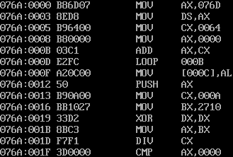
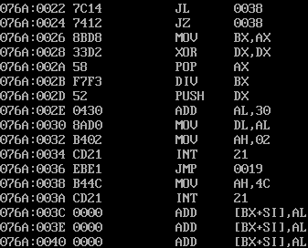
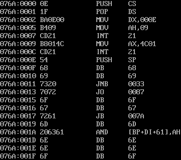
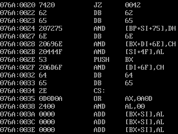

# Assignment 3 SUM

## 计算 1~100 的累加和

### 汇编代码

汇编代码如下：

```
.MODEL SMALL             ; 指定程序使用的小内存模型
.STACK 100h              ; 为堆栈分配256字节的空间

.DATA
    SumResult DB ?       ; 保存求和结果的变量
    OutputResult DB ?    ; 保存输出结果的变量

.CODE
START:
    MOV AX, @DATA        ; 将数据段的起始地址加载到AX寄存器
    MOV DS, AX           ; 设置数据段寄存器DS指向数据段
    MOV CX, 100          ; 初始化循环计数器CX为100
    MOV AX, 0            ; 初始化AX为0，准备累加

SumLoop:
    ADD AX, CX           ; 将CX中的值加到AX中
    LOOP SumLoop         ; 循环直到CX为0，每次减1并跳转到SumLoop
    MOV SumResult, AL    ; 将累加结果（AL）保存到SumResult变量中
    PUSH AX              ; 将AX压入堆栈，备用
    MOV CX, 10           ; 将CX初始化为10，用于输出时的除法
    MOV BX, 10000        ; 初始化BX为10000，作为输出处理的除数

PrintLoop:
    XOR DX, DX           ; 清空DX寄存器
    MOV AX, BX           ; 将BX的值加载到AX中，用于除法操作
    DIV CX               ; AX / CX，将商存储在AX，余数存储在DX
    CMP AX, 0            ; 比较商是否为0
    JL ExitProgram       ; 如果AX小于0，退出程序
    JE ExitProgram       ; 如果商为0，结束输出循环
    MOV BX, AX           ; 将商存入BX，继续循环处理下一个数字
    XOR DX, DX           ; 清空DX寄存器，准备下一次除法操作
    POP AX               ; 从堆栈中恢复AX的值
    DIV BX               ; AX / BX，计算余数
    PUSH DX              ; 将余数（个位数）压入堆栈，备用
    ADD AL, 30H          ; 将AL转换为对应的ASCII码数字
    MOV DL, AL           ; 将AL中的值移动到DL，用于输出
    MOV AH, 2            ; 设置DOS功能调用号为2，准备显示字符
    INT 21H              ; 调用DOS中断，输出字符
    JMP PrintLoop        ; 跳转回PrintLoop继续输出下一个数字

ExitProgram:
    MOV AH, 4CH          ; 设置DOS功能调用号为4CH，退出程序
    INT 21H              ; 调用DOS中断，结束程序

END START                ; 程序结束，定义入口为START
```

在编写本次汇编程序的过程中，我对寄存器、数据段和栈的不同用法有了更加深刻的理解。最开始，我将CX初始化为100，并通过将每次累加后的结果存储在**AX寄存器**中来进行快速计算。寄存器的优势在于它位于CPU内部，因此对于诸如加法这样的简单操作，寄存器的速度非常快。因此，我选择将中间计算结果暂时存放在AX寄存器中，这样在每次循环中都能够快速地更新总和值。

然而，寄存器的空间有限，当我们需要保存结果或者进行较复杂的数据管理时，数据段就显得非常重要。在这个程序中，我将最终的求和结果存储在**数据段**中的变量 `SumResult` 中。通过设置数据段寄存器DS指向数据段，我能够轻松地将AX中的值存储到内存中的 `SumResult`，这样就保证了程序可以随时读取和操作内存中的数据。

栈的使用也是程序中不可忽视的一部分。在程序的输出部分，我将计算后的结果压入**栈**中，通过栈的先进后出特性，能够有效管理寄存器和中间结果。栈在处理中断或临时保存数据时非常有用。例如，当我需要在输出前保存AX寄存器的值时，我通过 `PUSH AX` 将其压入栈中，稍后再通过 `POP AX` 恢复，保证了数据的一致性。这让我能够在处理多个步骤的过程中灵活管理寄存器的内容，而不必担心丢失关键数据。

通过这个程序的学习，我清晰地理解了如何在寄存器、数据段和栈中分别存储和处理数据。在寄存器中进行高效运算，在数据段中存储较大或持久化的数据，并通过栈在程序运行中保存和恢复状态。每种方式都有其独特的优势，合理运用这些存储机制可以极大提高汇编程序的效率和灵活性。

### 通过 C 语言实现并查看反汇编代码

C 语言代码：

```c
#include <stdio.h>

int main() {
    int sum = 0;
    for (int i = 1; i <= 100; i++) {
        sum += i;
    }
    printf("%d\n", sum);

    return 0;
}
```

部分反汇编代码：





部分反汇编代码解释如下：

```
076A:0000 B86D07      MOV AX,076D       ; 将 076D（指向数据段或栈的地址）加载到 AX 寄存器
076A:0003 8ED8        MOV DS,AX         ; 设置数据段寄存器 DS，准备访问数据
076A:0005 B96400      MOV CX,0064       ; 将 100（即十进制的 100）加载到 CX 寄存器，用于循环计数
076A:0008 B80000      MOV AX,0000       ; 初始化 AX 为 0，准备累加结果
076A:000B 03C1        ADD AX,CX         ; 将 CX（当前循环计数）加到 AX 中
076A:000D E2FC        LOOP 000B         ; 循环减 CX，直到 CX 为 0。每次将 AX 加上 CX 的值（循环累加）
076A:000F A20000      MOV [0000],AL     ; 将累加结果（AL）存入内存地址 0000
076A:0012 50          PUSH AX           ; 将累加结果 AX 压入栈，保存当前累加值
076A:0013 B90A00      MOV CX,000A       ; 将 10（十进制）加载到 CX，用于后续十进制输出
076A:0016 BB1027      MOV BX,2710       ; 将 10000（十进制）加载到 BX，准备进行十进制除法
076A:0019 33D2        XOR DX,DX         ; 将 DX 寄存器清零，为除法做准备（除法中 DX:AX 是被除数）
076A:001B F7F3        DIV BX            ; AX / BX，得到商和余数（用于处理最高位的数字）
076A:001D 8BC3        MOV AX,BX         ; 将 BX 的值移动到 AX，用于下一个除法操作
076A:001F F7F1        DIV CX            ; AX / CX，得到下一位的商和余数
076A:0022 7C14        JL 0038           ; 如果商小于 0，跳转到 0038，结束程序
076A:0024 7412        JZ 0038           ; 如果商为 0，跳转到 0038，结束程序
076A:0026 8BD8        MOV BX,AX         ; 将 AX 的值移入 BX，为后续除法准备
076A:0028 33D2        XOR DX,DX         ; 将 DX 清零，为下一次除法操作做准备
076A:002A 58          POP AX            ; 从栈中取回保存的 AX（即之前压入的累加结果）
076A:002B F7F3        DIV BX            ; AX / BX，得到下一位的商
076A:002D 52          PUSH DX           ; 将余数压入栈，准备输出这一位的数字
076A:002E 0430        ADD AL,30         ; 将 AL 中的数字转换为 ASCII 码字符（0-9）
076A:0030 BA0200      MOV DX,0002       ; 设置 DOS 中断调用，准备显示字符
076A:0033 CD21        INT 21H           ; 调用 DOS 中断，输出字符
076A:0035 EBEB        JMP 0019          ; 循环跳回，继续处理下一位数字
076A:0038 B44C        MOV AH,4C         ; 设置 DOS 结束程序的功能号
076A:003A CD21        INT 21H           ; 调用 DOS 中断，结束程序
076A:003C 8B1414      ADD [BX+SI],AL    ; 这行可能是无关的或者后续代码的残余，忽略
076A:003E 8B1415      ADD [BX+SI],AL    ; 同上，可能是反汇编过程中引入的误差
```

## 计算 1~n 的累加和

### 汇编代码

汇编代码如下：

```
.MODEL SMALL                           ; 使用小内存模型
.STACK 100h                            ; 为堆栈分配256字节的空间

.DATA
    prompt_msg  DB 'Input (1-100): $'  ; 输入提示消息
    sum_msg     DB 'Output: $'         ; 输出提示消息
    number      DW ?                   ; 用于存储输入的数字
    sum         DW 0                   ; 用于存储求和结果

.CODE
START:
    MOV AX, @DATA                      ; 将数据段地址加载到 AX
    MOV DS, AX                         ; 设置 DS 寄存器指向数据段
    MOV ES, AX                         ; 设置 ES 寄存器指向数据段
    LEA DX, prompt_msg                 ; 将提示信息的地址加载到 DX
    MOV AH, 09h                        ; 设置 DOS 功能号 09h，用于输出字符串
    INT 21h                            ; 调用 DOS 中断，显示提示信息
    XOR CX, CX                         ; 清空 CX 寄存器，作为输入累加器

READ_INPUT:
    MOV AH, 01h                        ; 设置 DOS 功能号 01h，读取键盘输入字符
    INT 21h                            ; 调用 DOS 中断读取输入字符到 AL
    CMP AL, 0Dh                        ; 检查是否按下回车键 (0Dh)
    JE  CALCULATE_SUM                  ; 如果按下回车键，跳转到求和过程
    SUB AL, '0'                        ; 将输入的字符转换为对应的数字
    MOV BL, AL                         ; 将 AL 中的数字保存到 BL
    MOV AX, CX                         ; 将累积值存入 AX
    MOV CX, 10                         ; 将 10 存入 CX 准备乘法
    MUL CX                             ; AX = AX * 10，处理多位数输入
    ADD AX, BX                         ; 将当前输入的数字添加到 AX
    MOV CX, AX                         ; 将结果存回 CX
    JMP READ_INPUT                     ; 跳回继续读取下一个字符

CALCULATE_SUM:
    MOV AX, CX                         ; 将输入的数字值从 CX 转移到 AX
    MOV number, AX                     ; 将输入的数字存储在 number 变量中
    MOV CX, AX                         ; 将数字转移到 CX，作为循环计数
    MOV BX, 1                          ; 初始化 BX 为 1，准备开始累加
    XOR AX, AX                         ; 清空 AX，准备存放求和结果

SUM_LOOP:
    ADD AX, BX                         ; AX = AX + BX，累加 BX 的值
    INC BX                             ; BX = BX + 1
    LOOP SUM_LOOP                      ; 循环直到 CX = 0，求和从 1 加到输入的数字
    MOV sum, AX                        ; 将求和结果存储在 sum 变量中
    LEA DX, sum_msg                    ; 将输出提示信息地址加载到 DX
    MOV AH, 09h                        ; 设置 DOS 功能号 09h，准备显示提示信息
    INT 21h                            ; 调用 DOS 中断显示提示信息
    MOV AX, sum                        ; 将求和结果加载到 AX
    CALL PRINT_DECIMAL                 ; 调用子程序，将结果以十进制输出
    MOV AH, 4Ch                        ; 设置 DOS 功能号 4Ch，准备结束程序
    INT 21h                            ; 调用 DOS 中断，结束程序

PRINT_DECIMAL PROC
    PUSH AX                            ; 保存 AX 寄存器的值
    PUSH BX                            ; 保存 BX 寄存器的值
    PUSH CX                            ; 保存 CX 寄存器的值
    PUSH DX                            ; 保存 DX 寄存器的值
    XOR CX, CX                         ; 清空 CX，作为位数计数器
    MOV BX, 10                         ; 设置除数为 10，用于将数字逐位提取

CONVERT_LOOP:
    XOR DX, DX                         ; 清空 DX，确保 DX:AX 的除法准备就绪
    DIV BX                             ; AX / 10，得到商存入 AX，余数存入 DX
    PUSH DX                            ; 将余数（个位数字）压入栈
    INC CX                             ; 增加 CX，记录栈中的位数
    CMP AX, 0                          ; 检查商是否为 0
    JNE CONVERT_LOOP                   ; 如果商不为 0，继续循环，处理下一位

PRINT_LOOP:
    POP DX                             ; 从栈中取出余数（从个位开始）
    ADD DL, '0'                        ; 将数字转换为对应的 ASCII 码字符
    MOV AH, 02h                        ; 设置 DOS 功能号 02h，准备显示字符
    INT 21h                            ; 调用 DOS 中断显示字符
    LOOP PRINT_LOOP                    ; 循环直到所有位都打印完毕
    POP DX                             ; 恢复 DX 的原始值
    POP CX                             ; 恢复 CX 的原始值
    POP BX                             ; 恢复 BX 的原始值
    POP AX                             ; 恢复 AX 的原始值
    RET                                ; 返回到主程序

PRINT_DECIMAL ENDP                     ; 结束子程序

END START                              ; 定义程序的入口为 START
```

汇编程序不像高级语言那样提供丰富的库函数，输入和输出操作需要依靠底层的系统调用。而在 DOS 系统中，中断 21h 就是处理这些操作的关键工具。在使用中断进行字符输入时，我学习到了如何通过设置不同的功能号来实现各种操作，比如使用功能号 01h 读取单个字符输入，将它保存到寄存器中，方便后续处理。这种直接操控硬件的方式让我对输入机制有了更深的理解。

同样，通过中断 21h 实现输出也让我学到了如何精确控制输出字符到屏幕。在程序中，我使用了功能号 09h 来输出一串以 $ 结尾的字符串。相比于现代编程语言的 print 或 console.log，这种方式更加底层，它让我更清晰地看到了程序如何一步步将数据从内存传输到显示设备。我还学会了使用功能号 02h 将单个字符从寄存器中取出并显示在屏幕上，这让我对字符编码和 ASCII 码之间的转换有了更直观的认识。

最重要的是，通过这些中断调用，我明白了在汇编中一切都是手动控制的，每一个中断调用、每一个寄存器的使用，都直接决定了程序的运行方式。这种学习体验让我在理解计算机底层工作原理的同时，也锻炼了我的逻辑思维和程序设计能力。通过中断实现输入输出，不仅让我感受到了与计算机硬件的直接对话，还让我对程序的执行流程有了更加细致的把握。

### 通过 C 语言实现并查看反汇编代码

C 语言代码：

```c
#include <stdio.h>

int main() {
    int sum = 0;
    int n = 0;
    printf("Input (1-100): ");
    scanf("%d", &n);
    for (int i = 1; i <= n; i++) {
        sum += i;
    }
    printf("Output: %d\n", sum);

    return 0;
}
```

部分反汇编代码：





部分反汇编代码解释如下：

```
076A:0000 0E              PUSH CS                ; 将代码段寄存器 CS 压入栈，保存当前代码段
076A:0001 1F              POP DS                 ; 将栈顶数据（CS）弹出，赋值给数据段寄存器 DS
076A:0002 BA0E00          MOV DX,000E            ; 将 0E 存入 DX，指向数据段中输入提示信息的偏移地址
076A:0005 B409            MOV AH,09              ; 设置 DOS 功能号 09h，准备输出字符串
076A:0007 CD21            INT 21h                ; 调用 DOS 中断，输出 "Input (1-100): " 提示信息
076A:0009 BB014C          MOV BX,4C01            ; 初始化 BX 寄存器，可能是中间数据准备
076A:000C CD21            INT 21h                ; 调用中断 21h，读取输入
076A:000E 54              PUSH SP                ; 压入栈指针，保存当前栈位置
076A:000F 68              DB 68                  ; 操作码，可能用于后续处理
076A:0010 69              DB 69                  ; 操作码，可能用于后续处理
076A:0016 7320            JNB 0033               ; 条件跳转，可能是处理非负输入或检测输入有效性
076A:0018 7072            JO 007A                ; 有符号溢出时跳转，可能是输入超出范围
076A:001A 206361          AND [BP+DI+611],AH     ; 位操作，将输入与某一位进行按位与操作
076A:001D 6E              DB 6E                  ; 操作码
076A:001F 6F              DB 6F                  ; 操作码
076A:0020 7420            JZ 0042                ; 检查是否为零，输入数字为0时跳转到结束处理
076A:0022 6D              DB 6D                  ; 操作码
076A:0023 65              DB 65                  ; 操作码
076A:0024 207275          AND [BP+SI+75],DH      ; 位操作，与输入数字进行按位操作
076A:0029 0D0A            OR AX,0A0D             ; 将 AX 中的结果与换行符结合
076A:002C 2400            ADD AL,00              ; 将 AL 中的值加 0，准备输出
076A:002E 0000            ADD [BX+SI],AL         ; 将 AL 中的结果输出
076A:0030 0000            ADD [BX+SI],AL         ; 重复输出操作
```