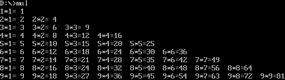
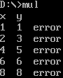

# Assignment 4 Multiplication Table

## 输出九九乘法表

程序执行结果：



汇编代码如下：

```
.MODEL SMALL               ; 定义内存模型为SMALL
.STACK 100h                ; 设置栈大小为256字节

.DATA
    RES DB 3 DUP(0)                                ; 用于存储3个字节的临时数据
    PR DB 00H, '*', 00H, '=', 2 DUP(2), '  ', '$'  ; 用于存储打印的格式，如乘数、乘号、结果等
    LINE DB 0DH, 0AH, '$'                          ; 换行符，0DH为回车符，0AH为换行符，最后的'$'用于INT 21H的结束符
    IPP DW 0000H                                   ; 临时寄存器，用于保存数据指针

.CODE
START:
    MOV AX, @DATA          ; 将数据段地址加载到AX寄存器中
    MOV DS, AX             ; 将数据段地址存储到DS中
    MOV CX, 9              ; 将CX初始化为9，表示循环次数（九九乘法表的最大数）

LOOP1:
    MOV DH, 0AH            ; 将10加载到DH中（十进制）
    SUB DH, CL             ; DH = 10 - CL, 通过减去CL，获取当前行的乘数
    MOV DL, 01H            ; 将1加载到DL中，表示当前列的乘数
    MOV AL, DH             ; 将当前行的乘数存储到AL中
    AND AX, 00FFH          ; 清除AX的高字节，仅保留低字节中的值

LOOP2:
    CMP DL, DH             ; 比较当前列乘数(DL)和行乘数(DH)
    JA NEXT                ; 如果列乘数大于行乘数，跳转到下一行
    PUSH DX                ; 保存DX寄存器的值到栈中
    PUSH CX                ; 保存CX寄存器的值到栈中
    PUSH AX                ; 保存AX寄存器的值到栈中
    PUSH DX                ; 再次保存DX，保持原值不变
    MOV AL, DH             ; 将行乘数加载到AL中
    MUL DL                 ; AL = DH * DL，即计算乘法结果
    PUSH AX                ; 将结果压栈
    CALL PRINT_LINE        ; 调用打印乘法行的子程序
    POP CX                 ; 恢复CX的值
    POP DX                 ; 恢复DX的值
    INC DL                 ; 列乘数递增1
    JMP LOOP2              ; 跳回LOOP2，继续计算和打印

NEXT:
    MOV DX, OFFSET LINE    ; 设置DX为换行符的地址
    MOV AH, 09H            ; 设置功能号为09H，用于字符串输出
    INT 21H                ; 调用DOS中断输出换行符
    LOOP LOOP1             ; CX减1，继续下一行的乘法表计算
    MOV AH, 4CH            ; 设置功能号为4CH，返回控制权给操作系统
    INT 21H                ; 调用DOS中断结束程序

PRINT_LINE PROC
    POP IPP                ; 从栈中恢复IPP
    POP DX                 ; 从栈中恢复DX，DX此时存储的是乘数
    MOV AX, DX             ; 将DX的值存储到AX中
    MOV BL, 0AH            ; 将10存储到BL中，用于十进制除法
    DIV BL                 ; AX = AX / 10，将结果分为十位数和个位数
    CMP AL, 0              ; 判断十位数是否为0
    JZ SKIP_TENS           ; 如果十位数为0，跳转到SKIP_TENS
    ADD AL, 30H            ; 将十位数转换为ASCII码
    MOV PR+4, AL           ; 将十位数存储到PR中的位置
    JMP STORE_ONES         ; 跳转到存储个位数

SKIP_TENS:
    MOV PR+4, ' '          ; 如果十位数为0，显示为空格

STORE_ONES:
    ADD AH, 30H            ; 将个位数转换为ASCII码
    MOV PR+5, AH           ; 将个位数存储到PR中的位置
    POP AX                 ; 从栈中恢复AX
    AND AL, 0FH            ; 清除高4位，仅保留低4位
    ADD AL, 30H            ; 将乘数的个位转换为ASCII码
    MOV PR+2, AL           ; 将乘数的个位存储到PR中
    POP AX                 ; 从栈中恢复AX
    AND AL, 0FH            ; 清除高4位，仅保留低4位
    ADD AL, 30H            ; 将乘数的十位转换为ASCII码
    MOV PR, AL             ; 将乘数的十位存储到PR中
    MOV DX, OFFSET PR      ; 设置DX为PR的地址
    MOV AH, 09H            ; 设置功能号为09H，输出字符串
    INT 21H                ; 调用DOS中断输出结果
    PUSH IPP               ; 恢复IPP
    RET                    ; 返回

PRINT_LINE ENDP

END START                  ; 程序结束，入口为START
```

**过程调用的实现**：代码中 `PRINT_LINE` 这个过程展示了如何通过子程序完成复杂的功能。具体过程如下：

* 主程序在进行乘法计算后，将结果保存到栈中，并调用 `PRINT_LINE`。
* 进入 `PRINT_LINE` 过程后，首先通过 `POP` 指令恢复必要的数据。这是因为栈是后进先出的结构，数据必须按照存入的相反顺序取出。
* 通过计算和判断，生成正确的输出格式，并将结果打印到屏幕上。
* 子过程执行完毕后，使用 `RET` 指令返回主程序，继续循环。

在整个过程中，`PUSH` 和 `POP` 不仅用于传递数据，还用于保证调用完子过程后，主程序中的寄存器状态能够被完整恢复。通过这种方式，主程序和子程序之间的工作能够互不干扰，实现良好的模块化和可维护性。

**寄存器和参数传递**：汇编语言中并没有像高级语言那样的函数参数传递机制（如函数参数列表）。在这个代码中，参数的传递完全依赖于寄存器和栈。例如，乘法计算的结果通过 `AX` 寄存器传递给子过程，而其他临时变量如 `CX` 和 `DX` 则通过栈来保存和恢复。

子过程通过栈来接收这些数据并进行处理，最终返回计算结果并进行显示。栈在这其中扮演了临时数据存储的角色，避免了不同过程之间的相互干扰。

**程序的结构化设计**：在这段代码中，九九乘法表的计算和结果的打印被很好地分离。主程序负责计算每一组乘法，而 `PRINT_LINE` 子过程则负责格式化输出。这种设计思路类似于现代编程中的函数调用，通过将重复的功能抽象到子过程中，可以减少代码重复，提高可读性和可维护性。

## 九九乘法表纠错

程序执行结果：



汇编代码如下：

```
.MODEL SMALL
.STACK 100h

.DATA
    table db 7,2,3,4,5,6,7,8,9            ; 定义九九乘法表的数值部分
          db 2,4,7,8,10,12,14,16,18       ; 每行分别表示乘法表中一列的数据
          db 3,6,9,12,15,18,21,24,27
          db 4,8,12,16,7,24,28,32,36
          db 5,10,15,20,25,30,35,40,45
          db 6,12,18,24,30,7,42,48,54
          db 7,14,21,28,35,42,49,56,63
          db 8,16,24,32,40,48,56,7,72
          db 9,18,27,36,45,54,63,72,81
    info  db "x  y", 0DH, 0AH, '$'        ; 存储提示信息"x  y"，并以0DH 0AH结尾换行，'$'为字符串结束标志
    space db "  ", '$'                    ; 存储两个空格字符，用于输出格式调整
    err   db "  error", 0DH, 0AH, '$'     ; 存储"error"提示信息，用于输出错误信息
    endl  db 0DH, 0AH, '$'                ; 存储换行符

.CODE
START:
    MOV    AX, @DATA        ; 初始化数据段寄存器，将DS指向数据段
    MOV    DS, AX
    LEA    DX, info         ; 将info提示信息加载到DX寄存器
    MOV    AH, 09H          ; DOS中断21H功能调用：显示字符串
    INT    21H
    MOV    CX, 9            ; 初始化外循环计数器，控制行数（乘法表中的第几列）
    MOV    AX, 1            ; AX表示乘数
    MOV    SI, 0            ; SI用来指向乘法表数据的偏移量

A_LOOP:
    PUSH   CX               ; 保存CX（外循环计数器）
    PUSH   AX               ; 保存AX（乘数）
    MOV    BX, 1            ; BX表示被乘数，初始化为1
    MOV    CX, 9            ; 内循环计数器，控制列数（乘法表中的第几行）

B_LOOP:
    XOR    DX, DX           ; 清空DX，准备存储乘法表数据
    MOV    DL, table[SI]    ; 从表中加载当前乘法的正确结果
    MUL    BL               ; 将AX与BX相乘（模拟乘法运算）
    CMP    AX, DX           ; 比较计算结果和表中的正确结果
    JNE    OUTPUT_ERR       ; 如果不相等，跳转到输出错误处理
    JMP    CONTINUE         ; 如果相等，继续循环

OUTPUT_ERR:
    POP    DX               ; 恢复DX寄存器
    PUSH   DX               ; 保存当前DX
    MOV    AL, DL           ; 将表中的结果转换为ASCII字符
    ADD    AL, 30H
    MOV    AH, 02H          ; DOS中断21H功能调用：输出单个字符
    MOV    DL, AL
    INT    21H
    LEA    DX, space        ; 显示空格，用于输出格式调整
    MOV    AH, 09H
    INT    21H
    MOV    AL, BL           ; 将被乘数转换为ASCII字符
    ADD    AL, 30H
    MOV    DL, AL
    MOV    AH, 02H
    INT    21H
    LEA    DX, err          ; 显示错误提示信息
    MOV    AH, 09H
    INT    21H

CONTINUE:
    POP    AX               ; 恢复AX寄存器
    PUSH   AX               ; 保存AX寄存器
    INC    BX               ; 增加被乘数
    INC    SI               ; 移动到乘法表中的下一个数据
    LOOP   B_LOOP           ; 内循环结束，跳回B_LOOP继续
    POP    AX               ; 恢复AX寄存器
    INC    AX               ; 增加乘数
    POP    CX               ; 恢复外循环计数器
    LOOP   A_LOOP           ; 外循环结束，跳回A_LOOP继续
    MOV    AH, 4CH          ; DOS中断21H功能调用：程序正常结束
    INT    21H

END START
```

通过完成这次九九乘法表纠错程序，我深刻理解了汇编语言中过程调用的实现方式。在高级语言中，过程调用和返回通常由 `call` 和 `return` 实现，而在汇编中，则是通过寄存器的保存和恢复来模拟这种行为。代码中频繁使用了 `PUSH` 和 `POP` 指令来管理寄存器值，确保不同层次的循环和操作之间的数据不会相互干扰。

程序的数据传递和运算主要通过寄存器完成。比如，`MUL` 指令用于乘法运算，`CMP` 用于比较计算结果与表中预期结果，这与高级语言中的函数调用及条件判断有类似的效果。此外，数据存储在表格结构中，通过索引手动访问并与寄存器中的计算结果进行比较，展示了汇编语言中如何高效进行数据操作和传递。

这段代码通过寄存器管理、跳转指令和条件判断，展现了汇编语言中的模块化设计和手动过程调用的实现方式。这不仅加深了我对底层编程的理解，也让我体会到低级语言中的编程逻辑需要更多的细节控制和优化。