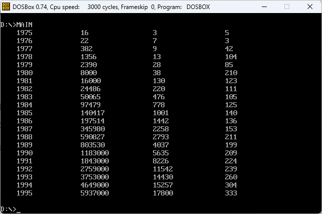

# Assignment 5 Salary

## 多汇编文件项目编译过程

本项目的编译流程可以分为以下几个阶段：编译、链接、执行。

为了提高程序的可读性和复用性，汇编项目通常会将不同功能模块划分到多个源文件中。在本例中，`MAIN.ASM` 包含主逻辑代码，而 `UTILS.ASM` 包含显示功能的工具函数。这种模块化设计便于代码的维护与功能扩展，同时也增强了代码的复用性。

```
MASM MAIN.ASM
MASM UTILS.ASM
LINK MAIN.OBJ UTILS.OBJ
```

* `MASM MAIN.ASM` 使用 MASM（Microsoft Macro Assembler）编译 `MAIN.ASM`，生成目标文件 `MAIN.OBJ`。此目标文件包含主程序代码。
* `MASM UTILS.ASM` 将 `UTILS.ASM` 编译为 `UTILS.OBJ`，其中包含辅助函数如 `DISPLAY_NUMBER`、`DISPLAY_TAB` 等。
* `LINK MAIN.OBJ UTILS.OBJ` 命令将 `MAIN.OBJ` 和 `UTILS.OBJ` 链接在一起，生成最终的可执行文件。此步骤确保主程序能够调用工具模块中的外部函数。

在汇编文件中使用外部函数时，需要明确声明：

```
EXTRN DISPLAY_NUMBER: FAR, DISPLAY_TAB: FAR, DISPLAY_NEWLINE: FAR
```

上述语句在 `MAIN.ASM` 中声明这些函数是外部定义的，编译器会在链接阶段通过目标文件解析这些符号。`UTILS.ASM` 通过 `PUBLIC` 关键字将函数导出，供其他模块调用。

`LINK` 命令不仅合并目标文件，还负责解析跨模块调用的符号。若某模块引用的外部符号在链接时未定义，链接器会抛出错误。这确保了所有模块间的依赖关系正确无误。

## 程序执行结果



## 主汇编文件 `MAIN.ASM`

```
STKSEG SEGMENT
    ; 定义堆栈段，初始化32个字为0
    DW 32 DUP(0)
STKSEG ENDS

DATASEG SEGMENT
    ; 定义年份数组，每个年份占4字节
    YEARS DB '1975','1976','1977','1978','1979','1980','1981','1982','1983','1984','1985','1986','1987','1988','1989','1990','1991','1992','1993','1994','1995'
    ; 定义收入数组，每个收入占4字节
    INCOMES DD 16,22,382,1356,2390,8000,16000,24486,50065,97479,140417,197514,345980,590827,803530,1183000,1843000,2759000,3753000,4649000,5937000
    ; 定义员工数量数组，每个数量占2字节
    EMPLOYEES DW 3,7,9,13,28,38,130,220,476,778,1001,1442,2258,2793,4037,5635,8226,11542,14430,15257,17800
DATASEG ENDS

TABLE SEGMENT
    ; 定义一个用于存储结果的表，每行21个字节
    DB 21 DUP('year summ ne ??')
TABLE ENDS

CODESEG SEGMENT
    ASSUME CS: CODESEG, DS: DATASEG, ES:TABLE

    ; 外部过程声明，用于显示数字、制表符和换行
    EXTRN DISPLAY_NUMBER: FAR, DISPLAY_TAB: FAR, DISPLAY_NEWLINE: FAR

MAIN_PROC PROC FAR
    ; 初始化数据段
    MOV AX, DATASEG
    MOV DS, AX

    ; 初始化表段
    MOV AX, TABLE
    MOV ES, AX
    MOV CX, 21                  ; 设置循环计数为21
    MOV SI, OFFSET YEARS        ; 指向年份数组
    MOV DI, 0                   ; 表示TABLE段的偏移地址

COPY_YEARS_LOOP:
    ; 将年份拷贝到表中
    MOVSB
    MOVSB
    MOVSB
    MOVSB
    ADD DI, 12                  ; 每次跳过12个字节（年后插入的空格）
    LOOP COPY_YEARS_LOOP

    ; 处理收入数据
    MOV CX, 21
    MOV SI, OFFSET INCOMES      ; 指向收入数组
    MOV DI, 5                   ; 表中收入的起始偏移量

COPY_INCOMES_LOOP:
    ; 将收入数据拷贝到表中
    MOV AX, [SI]
    MOV DX, [SI + 2]            ; 处理双字数据
    MOV ES:[DI], AX
    MOV ES:[DI + 2], DX
    ADD DI, 16                  ; 每次跳过16个字节
    ADD SI, 4                   ; 移动到下一个收入
    LOOP COPY_INCOMES_LOOP

    ; 处理员工数据
    MOV CX, 21
    MOV SI, OFFSET EMPLOYEES    ; 指向员工数量数组
    MOV DI, 10                  ; 表中员工数量的起始偏移量

COPY_EMPLOYEES_LOOP:
    ; 将员工数量拷贝到表中
    MOV AX, [SI]
    MOV ES:[DI], AX
    ADD DI, 16                  ; 每次跳过16个字节
    ADD SI, 2                   ; 移动到下一个员工数量
    LOOP COPY_EMPLOYEES_LOOP

    ; 计算平均收入
    MOV CX, 21
    MOV BX, 13                  ; 偏移量
    MOV SI, OFFSET INCOMES
    MOV DI, OFFSET EMPLOYEES

CALCULATE_AVERAGES_LOOP:
    PUSH BX

    ; 取出收入数据
    MOV AX, [SI]
    MOV DX, [SI + 2]
    ADD SI, 4

    ; 取出员工数据
    MOV BX, [DI]
    ADD DI, 2

    ; 计算平均收入 = 收入 / 员工
    DIV BX
    POP BX
    PUSH DI

    ; 将平均收入存储到表中
    MOV DI, BX
    MOV ES:[DI], AX
    ADD DI, 16
    MOV BX, DI
    POP DI
    LOOP CALCULATE_AVERAGES_LOOP

    ; 打印表格
    MOV BX, 21
    MOV SI, 0
    MOV AX, TABLE
    MOV DS, AX

PRINT_TABLE_LOOP:
    CALL DISPLAY_TAB            ; 打印制表符
    MOV CX, 4                   ; 打印年份的长度

PRINT_YEAR:
    MOV DL, [SI]                ; 逐个字符显示年份
    MOV AH, 02H
    INT 21H
    INC SI
    LOOP PRINT_YEAR

    ; 打印制表符
    CALL DISPLAY_TAB
    CALL DISPLAY_TAB
    CALL DISPLAY_TAB

    ; 打印收入
    INC SI
    MOV AX, [SI]
    ADD SI, 2
    MOV DX, [SI]
    ADD SI, 2
    CALL DISPLAY_NUMBER
    CALL DISPLAY_TAB
    CALL DISPLAY_TAB

    ; 打印员工数量
    INC SI
    MOV AX, [SI]
    MOV DX, 0
    ADD SI, 2
    CALL DISPLAY_NUMBER
    CALL DISPLAY_TAB
    CALL DISPLAY_TAB

    ; 打印平均收入
    INC SI
    MOV AX, [SI]
    MOV DX, 0
    ADD SI, 2
    CALL DISPLAY_NUMBER
    INC SI

    ; 换行
    CALL DISPLAY_NEWLINE
    DEC BX
    JNZ PRINT_TABLE_LOOP

    ; 正常退出程序
    MOV AX, 4C00H
    INT 21H

MAIN_PROC ENDP

CODESEG ENDS

END MAIN_PROC
```

* **段定义与初始化**
  * **堆栈段 `STKSEG`**：定义一个堆栈段，用于临时存储数据。该段包含 32 个双字（64 字节），所有初始值为 0。堆栈段在汇编语言中用于存放函数调用时的返回地址及局部变量。
  * **数据段 `DATASEG`**：定义了三个关键数组：
    * `YEARS`：存储从 1975 年到 1995 年的年份，每个年份以 4 个字节存储，共 21 个年份。
    * `INCOMES`：存储每个年份的公司收入，每项占 4 字节，数据类型为双字。
    * `EMPLOYEES`：存储每个年份的员工数量，每项占 2 字节，数据类型为字。
  * **表段 `TABLE`**：用于存储最终表格数据的段。初始内容为 21 个占位符字符串（`year summ ne ??`），每行 21 字节，便于后续的结果填充。
* **数据拷贝与处理**
  * **拷贝年份到表格段**：使用循环和 `MOVSB` 指令从 `YEARS` 中逐年拷贝年份数据到 `TABLE` 中的对应位置。每个年份占用 4 个字节，在表格中按 21 字节一行存储，跳过 12 个空字节用于后续填充收入和员工数据。
  * **拷贝收入数据**：从 `INCOMES` 数组中读取双字收入数据，并存入 `TABLE` 中的偏移位置（每行第 5 字节开始）。每次跳过 16 个字节间隔以匹配表格结构。
  * **拷贝员工数据**：通过类似操作，从 `EMPLOYEES` 中读取每年的员工数量，存储在表格的第 10 字节偏移处。每行员工数据在收入之后。
* **计算与存储平均收入**
  * **计算平均收入**：使用循环对每年收入除以员工数量，计算每年的平均收入。双字收入与字员工数量进行除法运算，结果存入表格相应偏移位置（每行第 13 字节起）。计算完成后，表格内每行依次包含：年份、收入、员工人数和平均收入。
* **表格打印功能**
  * **打印表格数据**：依次读取 `TABLE` 中存储的年份、收入、员工数量和平均收入，格式化并打印到屏幕上。每一行使用外部工具函数实现，调用 `DISPLAY_TAB` 插入空格对齐，`DISPLAY_NUMBER` 输出数字，`DISPLAY_NEWLINE` 换行。
  * **程序退出**：打印完成后，通过 `INT 21H` 中断指令正常退出

## 工具汇编文件 `UTILS.ASM`

```
CODESEG SEGMENT
    ASSUME CS: CODESEG

    ; 声明外部可用的公共过程
    PUBLIC DISPLAY_NUMBER, DISPLAY_TAB, DISPLAY_NEWLINE

; 显示数字的过程，将寄存器中的数字转换为ASCII并输出
DISPLAY_NUMBER PROC
    PUSH CX                       ; 保存寄存器值
    PUSH BX
    PUSH SI
    PUSH DI
    MOV DI, 10                    ; 用于计算数字的除数
    MOV SI, 0                     ; 存储转换后数字的长度

NUMBER_CONVERSION_LOOP:
    MOV CX, 10                    ; 基数10（十进制）
    CALL DIVIDE_DOUBLEWORD        ; 调用除法过程，将双字除以10
    PUSH CX                       ; 保存商，用于后续输出
    INC SI                        ; 数字长度增加
    CMP AX, 0
    JNZ NUMBER_CONVERSION_LOOP    ; 如果商不为0，继续转换
    CMP DX, 0
    JNZ NUMBER_CONVERSION_LOOP    ; 如果余数不为0，继续转换
    MOV BX, DI
    SUB BX, SI                    ; 计算数字前需要填充的空格数量

DISPLAY_DIGITS_LOOP:
    POP DX                        ; 弹出数字
    ADD DL, '0'                   ; 将数字转换为ASCII字符
    MOV AH, 02H                   ; 调用DOS中断显示字符
    INT 21H
    DEC SI                        ; 减少剩余数字长度
    JNZ DISPLAY_DIGITS_LOOP       ; 如果还有数字，继续显示

DISPLAY_SPACES_LOOP:
    CMP BX, 0                     ; 判断是否需要显示空格
    JLE DISPLAY_DONE
    MOV DL, ' '                   ; 空格字符
    MOV AH, 02H                   ; 调用DOS中断显示空格
    INT 21H
    DEC BX                        ; 减少剩余空格数
    JMP DISPLAY_SPACES_LOOP       ; 循环显示空格

DISPLAY_DONE:
    POP DI                        ; 恢复寄存器值
    POP SI
    POP BX
    POP CX
    RET                           ; 返回

DISPLAY_NUMBER ENDP

; 双字除法过程，用于处理AX:DX / CX
DIVIDE_DOUBLEWORD PROC
    PUSH BX                       ; 保存寄存器值
    PUSH AX
    MOV AX, DX                    ; 高字部分移入AX
    MOV DX, 0
    DIV CX                        ; 计算高字部分除以CX
    POP BX
    PUSH AX                       ; 保存高字商
    MOV AX, BX                    ; 低字部分移入AX
    DIV CX                        ; 计算低字部分除以CX
    MOV CX, DX                    ; 保存低字余数
    POP DX                        ; 恢复原DX
    POP BX
    RET                           ; 返回

DIVIDE_DOUBLEWORD ENDP

; 显示制表符的过程（4个空格）
DISPLAY_TAB PROC FAR
    PUSH DX                       ; 保存寄存器值
    PUSH AX
    MOV DL, ' '                   ; 空格字符
    MOV AH, 02H                   ; 调用DOS中断显示字符
    INT 21H
    INT 21H
    INT 21H
    INT 21H                       ; 连续调用四次，输出四个空格
    POP AX                        ; 恢复寄存器值
    POP DX
    RET                           ; 返回

DISPLAY_TAB ENDP

; 显示换行符的过程
DISPLAY_NEWLINE PROC FAR
    PUSH DX                       ; 保存寄存器值
    PUSH AX
    MOV DL, 13                    ; 回车符
    MOV AH, 02H                   ; 调用DOS中断显示回车
    INT 21H
    MOV DL, 10                    ; 换行符
    MOV AH, 02H                   ; 调用DOS中断显示换行
    INT 21H
    POP AX                        ; 恢复寄存器值
    POP DX
    RET                           ; 返回

DISPLAY_NEWLINE ENDP

CODESEG ENDS

END
```

* **段定义与公共过程声明**
  * **代码段 `CODESEG`**：定义了多个工具函数，包括数字显示、制表符显示和换行功能。这些函数通过 `PUBLIC` 关键字对外公开，供主程序调用。
* **工具函数详细解析**
  * **`DISPLAY_NUMBER`**：将双字数字转换为 ASCII 字符输出：
    * 使用 10 进制对数字进行转换，每次取商和余数。
    * 将结果按数字字符格式存储，依次输出。
    * 输出数字后，若有空格对齐需求，补齐空格，确保表格整齐。
  * **`DIVIDE_DOUBLEWORD`**：执行双字（64 位）除法操作：
    * 使用 AX，作为被除数，将其除以 CX。
    * 返回商（存储于 AX 和 BX）及余数（存储于 CX）。
    * 适用于大数值运算中的高位和低位操作。
  * **`DISPLAY_TAB`**：输出 4 个空格符，模拟制表符功能：
    * 通过调用 DOS 中断 `INT 21H` 输出空格字符。
    * 循环输出 4 次，以形成固定宽度的间距。
  * **`DISPLAY_NEWLINE`**：显示回车和换行符：
    * 使用 DOS 中断分别输出回车符（ASCII 13）和换行符（ASCII 10）。
    * 该过程确保光标移动到下一行开头。