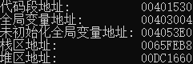
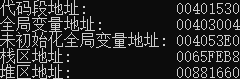
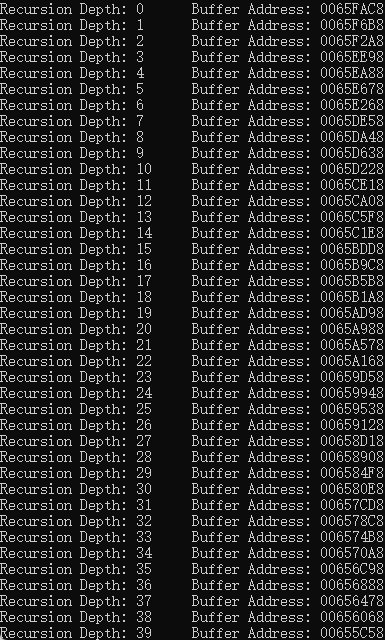
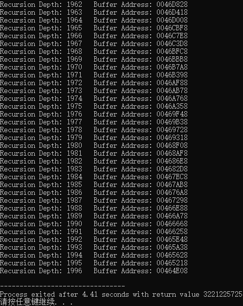
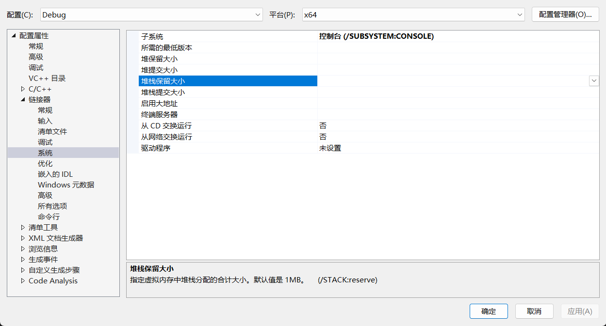

# Assignment 6 Stack Analysis

## 系统程序内存空间分布

### C 语言代码

下面这段 C 语言代码的目的是通过打印出程序中不同类型变量的内存地址，来帮助我们分析系统程序的内存空间分布情况。程序中的变量包括：

* 全局变量（已初始化和未初始化）
* 局部变量（栈区变量）
* 堆区变量（通过动态内存分配得到）

```c
#include <stdio.h>
#include <stdlib.h>

// 全局变量（已初始化）
int global_var = 1;

// 全局变量（未初始化）
int uninitialized_var;

// 打印各个变量存储地址的函数
void print_addresses() {
    // 局部变量
    int local_var = 2;

    // 动态分配内存，创建堆区变量
    int* heap_var = (int*)malloc(sizeof(int));
    if (heap_var == NULL) {
        printf("内存分配失败\n");  // 如果内存分配失败，输出错误信息
        return;
    }

    *heap_var = 3;  // 给堆区变量赋值

    // 打印各个变量的存储地址
    printf("代码段地址:           %p\n", (void*)print_addresses);     // 打印代码段地址
    printf("全局变量地址:         %p\n", (void*)&global_var);         // 打印全局变量的地址
    printf("未初始化全局变量地址: %p\n", (void*)&uninitialized_var);  // 打印未初始化的全局变量地址
    printf("栈区地址:             %p\n", (void*)&local_var);          // 打印栈区局部变量的地址
    printf("堆区地址:             %p\n", (void*)heap_var);            // 打印堆区变量的地址

    // 释放堆区内存
    free(heap_var);
}

int main() {
    print_addresses();  // 调用打印地址的函数

    return 0;
}
```

### 代码分析

每个变量及其内存分配的位置：

* **代码段（Text Segment）**
  * 存放程序的机器指令，也就是我们编写的程序代码。`print_addresses` 函数的地址属于代码段。
  * `printf("代码段地址: %p\n", (void*)print_addresses);` 这行代码打印的是代码段的地址。
* **全局变量部分（Data Segment）**
  * 已初始化的全局变量：比如 `global_var`，它在内存中会有明确的初始值（在这个例子中是1）。这类变量通常会被存储在数据段（Data Segment）。
  * 未初始化的全局变量：例如 `uninitialized_var`，它在程序开始时不会被赋值，因此它在数据段中会有一个默认值（通常为0）。未初始化的全局变量通常也存储在数据段的"BSS"部分。
* **栈区（Stack Segment）**
  * 栈区用于存储函数的局部变量和函数调用时的临时数据。在这段代码中，局部变量 `local_var` 存储在栈区。
  * `printf("栈区地址: %p\n", (void*)&local_var);` 这行代码打印的是栈区局部变量 `local_var` 的内存地址。
* **堆区（Heap Segment）**
  * 堆区用于存储动态分配的内存。通过调用 `malloc` 函数动态分配内存，`heap_var` 指向堆区分配的内存。
  * `printf("堆区地址: %p\n", (void*)heap_var);` 这行代码打印的是堆区分配的内存地址。

### 内存空间分布情况

* **代码段地址**
  * 程序中的函数（如 `print_addresses`）和常量字符串存储在代码段中，代码段的地址通常位于内存的低位区域，且通常是只读的。
* **数据段**
  * 已初始化的全局变量（如 `global_var`）存储在数据段的某个位置，地址通常高于代码段，但低于栈区。
  * 未初始化的全局变量（如 `uninitialized_var`）存储在数据段的 BSS 部分。BSS段通常位于数据段的下部，未初始化的全局变量会被分配到这个区域，并且它们的值默认为零。
* **栈区**
  * 局部变量（如 `local_var`）存储在栈区。栈从高地址向低地址增长，函数调用时会把局部变量压入栈中，函数返回时会弹出。
  * 在打印栈区地址时，栈区的地址通常会比全局变量的地址低，且局部变量的地址随着函数调用的栈帧的创建和销毁而发生变化。
* **堆区**
  * 动态内存（如通过 `malloc` 分配的内存）存储在堆区。堆区地址通常比栈区地址高，并且堆区内存是程序通过动态内存管理函数（如 `malloc`、`free`）进行分配和释放的。
  * 堆区的内存分配没有明确的大小限制，程序可以根据需要动态申请和释放内存。

### 输出结果解释

* **代码段地址**：指向 `print_addresses` 函数的机器指令的地址，这个地址通常较低并位于内存的前部分。
* **全局变量地址**：指向已初始化全局变量 `global_var` 的内存地址，通常位于数据段的某个位置。
* **未初始化全局变量地址**：指向未初始化的全局变量 `uninitialized_var` 的内存地址，位于数据段的 BSS 部分。
* **栈区地址**：指向局部变量 `local_var` 的内存地址。栈区地址通常较高，且会随着函数调用的变化而改变。
* **堆区地址**：指向动态分配内存的地址（由 `malloc` 返回）。堆区通常位于栈区的上方，具有较高的地址。





每次执行**堆区地址是不同的**。原因是因为堆区的内存分配是动态的，且每次运行程序时，操作系统的内存管理机制（如堆内存分配器）会根据当前程序的运行状态、系统的内存使用情况以及操作系统的内存分配策略来选择不同的内存位置。具体来说：

* **动态分配**：`malloc` 函数在每次调用时会向操作系统请求一块空闲的内存区域。这个内存区域的地址不是固定的，它是由操作系统的堆内存管理器动态决定的。
* **地址空间随机化**：现代操作系统（如 Linux、Windows 等）通常启用地址空间布局随机化（ASLR），这是一种安全技术，用来随机化程序的内存分配位置，以防止恶意攻击（如缓冲区溢出攻击）。因此，即使是同一段程序，每次运行时，堆区的起始地址也可能会有所不同。
* **内存碎片化**：随着程序的执行，堆区的内存可能会发生碎片化，即一部分内存被释放，而另一部分内存被重新分配。在不同的程序运行过程中，堆内存的使用情况不同，导致每次 `malloc` 获取的内存地址不同。

### 内存空间布局总结

从上面的分析可得出，程序内存的分布大致为：

* 低地址 → 代码段（存放程序指令）
* 数据段（包括已初始化和未初始化的全局变量）
* 栈区（存放局部变量，栈从高地址向低地址增长）
* 堆区（存放动态分配的内存，堆从低地址向高地址增长）

这种内存布局在大多数基于x86-64架构的操作系统中都是标准的，它确保了程序的不同部分不会互相覆盖，并能够有效地进行内存管理。

## 系统栈空间默认大小

### C 语言代码

该 C 语言代码的目的是展示递归调用过程中栈空间的使用情况。每次递归都会在栈上分配一个新的 `buffer`，因此可以观察栈空间如何随递归深度增加而逐渐增长。由于栈空间有限，当递归深度过深时可能会导致栈溢出。

```c
#include <stdio.h>

// 递归函数，模拟系统栈空间的使用
void recursive_function(int depth) {
    // 在栈上分配一个大小为 1000 字节的缓冲区
    char buffer[1000];

    // 打印当前递归的深度和缓冲区的地址
    printf("Recursion Depth: %d\tBuffer Address: %p\n", depth, buffer);

    // 如果递归深度小于 10000，则继续递归
    if (depth < 10000) {
        recursive_function(depth + 1);
    }
}

int main() {
    // 从递归深度 0 开始调用递归函数
    recursive_function(0);

    return 0;
}
```

### 代码分析

* **递归函数 `recursive_function`**：
  * 每次调用都会在栈上分配一个 `char` 类型的缓冲区 `buffer`，大小为 1000 字节。
  * `printf` 输出当前递归的深度（`depth`）和缓冲区的地址（`buffer`）。
  * 如果递归深度小于 10000，继续递归调用自己。
* **主函数 `main`**：
  * 程序从递归深度 0 开始调用 `recursive_function`。

### 输出结果解释

递归调用时每次分配的 `buffer` 地址是逐渐变化的，并且随着递归深度的增加，地址也逐步减小，直到程序崩溃。





栈空间使用情况：

* **递归地址变化**：每次调用 `recursive_function` 时，局部变量 `buffer` 被分配在栈上。你可以看到随着递归深度的增加，`buffer` 的地址逐渐变化，并且地址越来越低。这表明栈空间是向下增长的，即栈的起始地址较高，随着每次递归调用，栈空间指针逐步向低地址扩展。

* **栈溢出**：最终你看到程序以错误代码 3221225725 退出，这是一个典型的栈溢出错误。这个错误通常发生在递归深度过深时，栈空间耗尽，程序无法再为新的函数调用分配栈帧。

### 系统栈空间大小

递归深度达到大约 1996 时，程序崩溃并出现了栈溢出错误。每次递归时，你的程序都会分配一个 1000 字节大小的局部数组 `buffer`，这意味着每次递归调用都会消耗 1000 字节的栈空间。

因此，估算栈空间大小可以通过以下方式计算：

$$
栈空间大小=1000字节×1996=1,996,000字节≈2MB
$$

从这个计算结果来看，程序在递归深度约为 1996 时崩溃，栈空间大致为 **2 MB** 左右。

### 修改栈空间大小

在 Visual Studio 中，可以通过修改项目的属性来设置或调整栈空间的大小。以下是修改栈大小的步骤：

* **右键点击项目**
  * 在解决方案资源管理器中，右键点击你的项目，选择属性。
* **进入链接器设置**
  * 在弹出的项目属性窗口中，找到 **配置属性 > 链接器 > 系统**。
* **修改栈保留大小**
  * 在栈保留大小（Stack Reserve Size）字段中，你可以修改栈的保留大小。默认情况下，栈的保留大小通常是 1MB（1048576 字节）。
  * 例如，如果你希望将栈大小设置为 4MB，可以将该值设置为 4194304（4MB 的字节数）。
* **修改栈提交大小**
  * 你还可以设置栈提交大小（Stack Commit Size），它指定了程序启动时分配的栈空间量。这个值通常与栈保留大小相同，或者比栈保留大小小。如果你想增加栈的初始空间，可以增大这个值。
* **应用更改**
  * 修改完之后，点击应用和确定，然后重新编译程序。



## 两层嵌套函数反汇编分析

### C 语言代码

```c
int inner_fun(int a, int b) {
	return a + b;
}

int outer_fun(int a, int b) {
	int c = inner_fun(a, b);
	return c * c;
}

int main() {
	int n = outer_fun(1, 2);

	return 0;
}
```

### MSVC 反汇编代码

在 Visual Studio 中查看 MSVC 生成的反汇编代码，可以使用内置的调试器。在调试模式下编译项目，并启用调试信息。在调试过程中，打开调试窗口，选择 **调试 > Windows > 反汇编（或按 Ctrl+Alt+D）** 来查看反汇编代码。可以单步执行程序（F10 / F11）并观察对应的汇编指令，调试器会显示当前源代码和反汇编代码的对应关系。

```
int inner_fun(int a, int b) {
00007FF799931787  or          byte ptr [rbp+57h],dl
00007FF79993178A  sub         rsp,0E8h
00007FF799931791  lea         rbp,[rsp+20h]
00007FF799931796  lea         rcx,[__57606C2A_main@cpp (07FF799941000h)]
00007FF79993179D  call        __CheckForDebuggerJustMyCode (07FF79993135Ch)
    return a + b;
00007FF7999317A2  mov         eax,dword ptr [b]
00007FF7999317A8  mov         ecx,dword ptr [a]
00007FF7999317AE  add         ecx,eax
00007FF7999317B0  mov         eax,ecx
}
00007FF7999317B2  lea         rsp,[rbp+0C8h]
00007FF7999317B9  pop         rdi
00007FF7999317BA  pop         rbp
00007FF7999317BB  ret

int outer_fun(int a, int b) {
00007FF7999317D0  mov         dword ptr [rsp+10h],edx
00007FF7999317D4  mov         dword ptr [rsp+8],ecx
00007FF7999317D8  push        rbp
00007FF7999317D9  push        rdi
00007FF7999317DA  sub         rsp,108h
00007FF7999317E1  lea         rbp,[rsp+20h]
00007FF7999317E6  lea         rcx,[__57606C2A_main@cpp (07FF799941000h)]
00007FF7999317ED  call        __CheckForDebuggerJustMyCode (07FF79993135Ch)
    int c = inner_fun(a, b);
00007FF7999317F2  mov         edx,dword ptr [b]
00007FF7999317F8  mov         ecx,dword ptr [a]
00007FF7999317FE  call        inner_fun (07FF7999311EAh)
00007FF799931803  mov         dword ptr [c],eax
    return c * c;
00007FF799931806  mov         eax,dword ptr [c]
00007FF799931809  imul        eax,dword ptr [c]
}
00007FF79993180D  lea         rsp,[rbp+0E8h]
00007FF799931814  pop         rdi
00007FF799931815  pop         rbp
00007FF799931816  ret

int main() {
00007FF799931840  push        rbp
00007FF799931842  push        rdi
00007FF799931843  sub         rsp,108h
00007FF79993184A  lea         rbp,[rsp+20h]
00007FF79993184F  lea         rcx,[__57606C2A_main@cpp (07FF799941000h)]
00007FF799931856  call        __CheckForDebuggerJustMyCode (07FF79993135Ch)
    int n = outer_fun(1, 2);
00007FF79993185B  mov         edx,2
00007FF799931860  mov         ecx,1
00007FF799931865  call        outer_fun (07FF79993111Dh)
00007FF79993186A  mov         dword ptr [n],eax

    return 0;
00007FF79993186D  xor         eax,eax
}
00007FF79993186F  lea         rsp,[rbp+0E8h]
00007FF799931876  pop         rdi
00007FF799931877  pop         rbp
00007FF799931878  ret
```

### 反汇编代码分析

#### `inner_fun` 函数的反汇编分析

```
00007FF799931787  or          byte ptr [rbp+57h],dl                         ; 这个指令并没有实际意义，可能是调试信息
00007FF79993178A  sub         rsp,0E8h                                      ; 函数入口，调整栈指针，创建栈帧
00007FF799931791  lea         rbp,[rsp+20h]                                 ; 更新基指针寄存器 rbp，设置新的栈帧
00007FF799931796  lea         rcx,[__57606C2A_main@cpp (07FF799941000h)]    ; 调用调试工具 __CheckForDebuggerJustMyCode
00007FF79993179D  call        __CheckForDebuggerJustMyCode (07FF79993135Ch) ; 检查调试器是否存在
00007FF7999317A2  mov         eax,dword ptr [b]                             ; 将参数 b 的值加载到 eax 寄存器
00007FF7999317A8  mov         ecx,dword ptr [a]                             ; 将参数 a 的值加载到 ecx 寄存器
00007FF7999317AE  add         ecx,eax                                       ; 将 a + b 的结果存入 ecx 寄存器
00007FF7999317B0  mov         eax,ecx                                       ; 将 ecx 的结果赋值给 eax 寄存器（返回值）
00007FF7999317B2  lea         rsp,[rbp+0C8h]                                ; 恢复栈指针
00007FF7999317B9  pop         rdi                                           ; 恢复 rdi 寄存器
00007FF7999317BA  pop         rbp                                           ; 恢复基指针寄存器 rbp
00007FF7999317BB  ret                                                       ; 返回到调用位置
```

#### `outer_fun` 函数的反汇编分析

```
00007FF7999317D0  mov         dword ptr [rsp+10h],edx                       ; 保存参数 b 到栈中
00007FF7999317D4  mov         dword ptr [rsp+8],ecx                         ; 保存参数 a 到栈中
00007FF7999317D8  push        rbp                                           ; 保存原栈帧，创建新的栈帧
00007FF7999317D9  push        rdi                                           ; 保存寄存器 rdi
00007FF7999317DA  sub         rsp,108h                                      ; 调整栈空间
00007FF7999317E1  lea         rbp,[rsp+20h]                                 ; 设置栈帧
00007FF7999317E6  lea         rcx,[__57606C2A_main@cpp (07FF799941000h)]    ; 调用调试工具 __CheckForDebuggerJustMyCode
00007FF7999317ED  call        __CheckForDebuggerJustMyCode (07FF79993135Ch) ; 检查调试器是否存在
00007FF7999317F2  mov         edx,dword ptr [b]                             ; 将参数 b 加载到 edx 寄存器
00007FF7999317F8  mov         ecx,dword ptr [a]                             ; 将参数 a 加载到 ecx 寄存器
00007FF7999317FE  call        inner_fun (07FF7999311EAh)                    ; 调用 inner_fun 函数
00007FF799931803  mov         dword ptr [c],eax                             ; 将 inner_fun 返回值保存到局部变量 c
00007FF799931806  mov         eax,dword ptr [c]                             ; 加载 c 的值到 eax
00007FF799931809  imul        eax,dword ptr [c]                             ; 将 c 的平方（c * c）存入 eax
00007FF79993180D  lea         rsp,[rbp+0E8h]                                ; 恢复栈指针
00007FF799931814  pop         rdi                                           ; 恢复寄存器 rdi
00007FF799931815  pop         rbp                                           ; 恢复基指针寄存器 rbp
00007FF799931816  ret                                                       ; 返回到调用位置
```

#### `main` 函数的反汇编分析

```
00007FF799931840  push        rbp                                           ; 保存栈帧，设置新的栈帧
00007FF799931842  push        rdi                                           ; 保存寄存器 rdi
00007FF799931843  sub         rsp,108h                                      ; 调整栈空间
00007FF79993184A  lea         rbp,[rsp+20h]                                 ; 设置栈帧
00007FF79993184F  lea         rcx,[__57606C2A_main@cpp (07FF799941000h)]    ; 调用调试工具 __CheckForDebuggerJustMyCode
00007FF799931856  call        __CheckForDebuggerJustMyCode (07FF79993135Ch) ; 检查调试器是否存在
00007FF79993185B  mov         edx,2                                         ; 将 2 传递给参数 b
00007FF799931860  mov         ecx,1                                         ; 将 1 传递给参数 a
00007FF799931865  call        outer_fun (07FF79993111Dh)                    ; 调用 outer_fun 函数
00007FF79993186A  mov         dword ptr [n],eax                             ; 将 outer_fun 返回值存储在变量 n 中
00007FF79993186D  xor         eax,eax                                       ; 返回 0 (将 eax 清零)
00007FF79993186F  lea         rsp,[rbp+0E8h]                                ; 恢复栈指针
00007FF799931876  pop         rdi                                           ; 恢复寄存器 rdi
00007FF799931877  pop         rbp                                           ; 恢复基指针寄存器 rbp
00007FF799931878  ret                                                       ; 返回到调用位置
```

### 总结

#### 栈帧管理

每个函数调用时，操作系统会为该函数分配一块栈空间，这块空间称为栈帧。栈帧主要用于存储以下内容：

* **局部变量**：每个函数的局部变量会分配一定的栈空间。
* **保存的寄存器**：当函数调用时，可能会使用一些寄存器（如 `rbp`、`rsp`、`rax`、`rcx` 等），这些寄存器的值需要在函数返回时恢复。
* **返回地址**：每次函数调用时，调用指令的下一条指令地址会被压入栈中，以便函数执行完毕后能够正确返回。

栈帧的创建与销毁：

* **创建栈帧**：每次函数被调用时，会通过 `sub rsp, size` 指令来为局部变量分配栈空间，同时保存寄存器的当前值（如 `rbp`、`rbx` 等）。然后，`lea rbp, [rsp+offset]` 将 `rbp` 寄存器指向新的栈帧基准位置。
* **销毁栈帧**：函数返回时，会通过 `pop` 恢复寄存器的值，`add rsp, size` 恢复栈指针的位置，从而销毁栈帧。

在 `inner_fun` 和 `outer_fun` 中，栈空间的分配方式比较相似，都是通过 `sub rsp, size` 分配栈空间，设置基指针并在函数执行完毕后销毁栈帧。

#### 栈调用顺序

栈调用顺序是由函数的调用关系和每个函数的栈帧管理决定的。在此程序中，调用顺序如下：

* `main` 调用 `outer_fun`：在 `main` 函数中，栈空间分配后，参数 `1` 和 `2` 被传递给 `outer_fun`，然后执行 `call outer_fun` 指令。栈帧为 `outer_fun` 函数分配空间，栈指针（`rsp`）调整，并开始执行 `outer_fun`。
* `outer_fun` 调用 `inner_fun`：在 `outer_fun` 中，栈帧已经为 `a` 和 `b` 的参数分配好空间，然后通过 `call inner_fun` 进入 `inner_fun` 函数。`inner_fun` 计算 `a + b` 后返回，返回值存入局部变量 `c`，并且 `outer_fun` 会继续执行剩余的代码来返回 `c * c`。
* 函数返回：
  * `inner_fun` 返回：当 `inner_fun` 执行完毕后，栈帧被销毁，`eax` 中的返回值（`a + b`）被传递回 `outer_fun`，栈指针恢复到调用前的状态。
  * `outer_fun` 返回：同样地，`outer_fun` 在执行完返回 `c * c` 后，栈帧被销毁，栈指针恢复，`main` 函数继续执行。
  * `main` 返回：最后，`main` 执行完毕后，通过 `ret` 指令返回，栈帧被销毁，控制权回到操作系统或调用者。

每个函数调用时都会压入当前的返回地址，返回时会弹出这些地址，从而保证函数调用的正确顺序。

#### 栈指针与基指针的管理

* **`rsp`（栈指针）**：`rsp` 指向栈顶（即最新的栈元素）。每次压栈（如 `push` 操作）时，`rsp` 会减少；每次弹栈（如 `pop` 操作）时，`rsp` 会增加。
* **`rbp`（基指针）**：`rbp` 用于指向当前栈帧的基准位置，通常用来管理局部变量和保存的寄存器。在函数调用时，`rbp` 会被设置为栈帧的起始位置，确保栈空间的结构不被破坏。