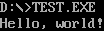

# Exercise 1 Procedure Call

## 程序执行结果



## 汇编代码

```
.MODEL SMALL                      ; 指定内存模型为 SMALL 模型
.STACK 100h                       ; 为堆栈段分配 256 字节的空间

.DATA
    msg db "Hello, world!$", 0    ; 定义字符串 msg，以 "$" 结尾，用于 DOS 中断显示

.CODE
START:
    MOV AX, @DATA                 ; 将数据段的地址加载到 AX 寄存器
    MOV DS, AX                    ; 将数据段地址赋值给 DS 寄存器，初始化数据段
    CALL PrintMessage             ; 调用 PrintMessage 过程，显示消息
    MOV AX, 4C00h                 ; 设置程序返回码 0，准备退出程序
    INT 21h                       ; 使用 DOS 中断 21h 来结束程序

; PrintMessage 过程开始
PrintMessage PROC
    MOV AH, 09h                   ; 设置 AH 为 09h，调用 DOS 中断 21h 的显示字符串功能
    LEA DX, msg                   ; 将 msg 字符串的地址加载到 DX 寄存器
    INT 21h                       ; 调用中断 21h，显示字符串
    RET                           ; 返回到调用 PrintMessage 的地方
PrintMessage ENDP                 ; 结束 PrintMessage 过程

END START                         ; 程序入口为 START
```

## 练习总结

在这个练习中，我们主要学习了在汇编语言中实现过程调用（Procedure Call）的基本方法。以下是关键要点：

1. **过程的定义和结构**
   * 汇编中，过程（类似于子程序或函数）可以用 `PROC` 和 `ENDP` 指令包裹起来。例如 `PrintMessage PROC` 和 `PrintMessage ENDP` 定义了一个名为 `PrintMessage` 的过程。
   * 过程的结构具有良好的封装性，可以实现代码的复用，使程序更易于理解和维护。
2. **调用过程**
   * 使用 `CALL` 指令可以调用一个过程。例如，`CALL PrintMessage` 将跳转到 `PrintMessage` 的地址执行代码。
   * 调用过程时，CPU 会自动将返回地址压入堆栈，以便在过程执行完毕后可以返回到调用过程的地方继续执行。
3. **返回指令**
   * `RET` 指令用于从过程返回。执行 `RET` 时，CPU 会从堆栈中弹出返回地址，并跳转到该地址，继续主程序的执行。
   * 使用 `RET` 指令确保了过程的调用位置是动态的，可以在多个位置调用同一过程。
4. **可复用性**
   * 使用过程调用将功能模块化，比如 `PrintMessage` 过程可以独立完成字符串打印功能。
   * 这种设计提高了代码的可读性和复用性，其他代码段需要打印相同字符串时可以直接调用 `PrintMessage，而无需重复写代码。`
5. **中断调用**
   * 在 `PrintMessage` 过程中，使用了 `INT 21h` DOS 中断来输出字符串。设置 `AH=09h` 并将字符串地址放入 `DX` 寄存器即可显示字符串。
   * 这展示了如何在汇编中结合中断和过程调用完成具体功能。

通过这个练习，我们掌握了过程调用的基本原理，并学会了 `CALL` 和 `RET` 指令的使用，为编写更复杂、更模块化的汇编程序打下了基础。