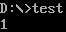
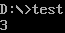
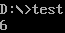
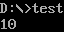
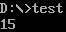
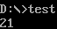
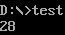
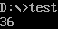
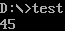
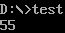

# Exercise 2 Recursive Call

## 程序执行结果

$Fibonacci(1)$ :



$Fibonacci(2)$ :



$Fibonacci(3)$ :



$Fibonacci(4)$ :



$Fibonacci(5)$ :



$Fibonacci(6)$ :



$Fibonacci(7)$ :



$Fibonacci(8)$ :



$Fibonacci(9)$ :



$Fibonacci(10)$ :



## 汇编代码

```
.MODEL SMALL
.STACK 100h

.DATA
fib_sum DW 0             ; 存储斐波那契数列之和
MAX_FIB DW 10            ; 需要计算的斐波那契数列的最大项数（设置为10以防递归栈溢出）
newline DB 13, 10, '$'

.CODE
; 递归计算斐波那契数
fib_recursive PROC
    ; 参数：n在AX中，返回的Fibonacci数值在AX中
    PUSH BP              ; 保存BP
    MOV BP, SP           ; 设置新的栈帧
    CMP AX, 0            ; 检查是否是fib(0)
    JE fib_zero
    CMP AX, 1            ; 检查是否是fib(1)
    JE fib_one

    ; 计算fib(n-1)
    PUSH AX              ; 保存当前n值
    DEC AX               ; 计算n-1
    CALL fib_recursive   ; 调用fib_recursive(n-1)
    MOV BX, AX           ; 保存fib(n-1)结果到BX

    ; 计算fib(n-2)
    POP AX               ; 取回n值
    DEC AX               ; 计算n-2
    CALL fib_recursive   ; 调用fib_recursive(n-2)

    ; 计算fib(n) = fib(n-1) + fib(n-2)
    ADD AX, BX           ; AX = fib(n-1) + fib(n-2)
    JMP end_fib          ; 跳转到结束

fib_zero:
    MOV AX, 0            ; fib(0) = 0
    JMP end_fib

fib_one:
    MOV AX, 1            ; fib(1) = 1

end_fib:
    MOV SP, BP           ; 恢复栈指针
    POP BP               ; 恢复BP
    RET

fib_recursive ENDP

main PROC
    MOV AX, @DATA
    MOV DS, AX

    ; 初始化计数器和清空fib_sum
    MOV CX, MAX_FIB      ; CX = 要计算的Fibonacci项数
    MOV AX, 0
    MOV fib_sum, AX      ; 清空fib_sum

; 循环计算前MAX_FIB项Fibonacci数并累加
fib_loop:
    MOV AX, CX           ; 当前项数放入AX
    CALL fib_recursive   ; 调用fib_recursive计算AX中的项数Fibonacci值
    ADD fib_sum, AX      ; 累加结果到fib_sum
    DEC CX               ; 减少CX，计算下一项
    JNZ fib_loop         ; 如果CX不为0，继续循环

    ; 输出计算结果（此处简化，只显示和）
    MOV AX, fib_sum
    CALL print_result

    ; 程序结束
    MOV AH, 4Ch
    INT 21h

main ENDP

print_result PROC
    ; 通过递归转换并打印fib_sum的值为ASCII（假设在AX中传入的值为fib_sum）
    MOV BX, 10           ; 基数10
    MOV CX, 0            ; CX将作为计数器，存放数字位数

print_loop:
    XOR DX, DX           ; 清空DX以准备除法
    DIV BX               ; AX = AX / 10, 余数在DX
    PUSH DX              ; 将余数压栈
    INC CX               ; 位数+1
    TEST AX, AX          ; 检查AX是否为0
    JNZ print_loop       ; 如果AX不为0继续循环

print_digits:
    POP DX               ; 取出一位数字
    ADD DL, '0'          ; 转换为ASCII字符
    MOV AH, 02h          ; DOS显示字符功能
    INT 21h              ; 显示字符
    LOOP print_digits    ; 循环直到CX=0

    ; 输出换行符
    LEA DX, newline
    MOV AH, 09h
    INT 21h
    RET

print_result ENDP

END main
```

## 练习总结

代码分析：

1. **基本功能**：这段代码旨在通过递归计算 Fibonacci 数列的前 n 项，并将这些项累加得到总和。要求的 Fibonacci 函数定义为 $F(n)=F(n−1)+F(n−2)$ ，并且 $F(0)=0$ ， $F(1)=1$ 。
2. **递归实现**：使用递归函数 `fib_recursive` 实现 Fibonacci 数列。递归基准条件处理 $F(0)=0$ 和 $F(1)=1$ 的情况，然后通过递归调用计算 $F(n−1)$ 和 $F(n−2)$ 的值。为了存储 Fibonacci 值并累加至总和，程序每次调用 `fib_recursive` 后将返回的结果累加到 `fib_sum` 中。
3. **寄存器和栈空间的管理**
   * 程序使用 `BP` 和 `SP` 管理递归调用的栈帧。每次调用递归函数时，程序都会保存和恢复 `BP`，确保正确的栈管理。
   * 代码采用 `push` 和 `pop` 机制保存中间值，避免寄存器覆盖。尤其是递归调用时，程序将参数和中间结果存入栈中，确保每次递归返回时能够恢复正确的上下文。
   * 栈大小设置为 `100h`（256字节），用于应对多次递归调用。但在递归层数较高时，仍可能发生栈溢出，因此实际运行中需要控制递归深度或调整栈大小。
4. **栈空间初始化**：栈空间经过初始化，以确保递归过程中不会出现栈溢出问题。`MAX_FIB` 设置为 10，作为测试值，以避免过多递归层级导致的溢出。实际使用中，如果希望处理更大的递归深度，可以增大栈空间，或者通过尾递归优化来减少栈开销。
5. **逐次观察栈变化**：可以通过逐步跟踪程序的执行来观察栈的变化情况。每次递归调用时，程序会在栈上压入新的参数和返回地址；每次返回时，栈上的空间则会被释放。
6. **程序执行结果**：程序在成功执行后，将前 n 项 Fibonacci 数列的和输出。输出部分包括调用 `print_result` 函数，将结果值转换为 ASCII 并显示。

练习总结：

* 本练习有效地演示了在汇编语言中实现递归函数的技巧，尤其是在低层级控制栈空间和寄存器的使用。
* 程序中递归实现了 Fibonacci 数列，并通过累加方式得到前 n 项的和。这种实现方式清晰地展示了递归调用在汇编语言中的应用，同时也验证了递归栈管理的重要性。
* 通过设置栈空间和适当的递归层级限制，可以确保程序的稳定性并防止栈溢出。