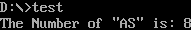

# Exercise 3 String Operations

## 程序执行结果



## 汇编代码

```
.MODEL SMALL
.STACK 100h

.DATA
STRBUF DB 'ASASAASASSASASAASAS'
COUNT EQU $-STRBUF
STRING DB 'AS'
MESSG DB 'The Number of "AS" is: $'
NUM DB 0                     ; 用于存储 "AS" 的出现次数
NEWLINE DB 0AH, 0DH, '$'

.CODE
MAIN PROC
    MOV AX, @DATA            ; 初始化数据段
    MOV DS, AX
    MOV NUM, 0               ; 初始化计数器 NUM 为 0
    MOV CX, COUNT            ; 设置循环计数为字符串的长度
    MOV SI, OFFSET STRBUF    ; SI 指向 STRBUF 的开始
    MOV DI, OFFSET STRING    ; DI 指向 STRING ("AS")

CHECK_LOOP:
    MOV AL, [SI]             ; 比较 STRBUF 中当前字符和 STRING 的第一个字符
    CMP AL, [DI]
    JNE NEXT_CHAR            ; 如果不匹配，跳到下一个字符
    MOV AL, [SI + 1]         ; 比较 STRBUF 中的下一个字符和 STRING 的第二个字符
    CMP AL, [DI + 1]
    JNE NEXT_CHAR            ; 如果不匹配，跳到下一个字符
    INC NUM                  ; 如果匹配 "AS"，增加 NUM 计数

NEXT_CHAR:
    INC SI                   ; 指向 STRBUF 中的下一个字符
    LOOP CHECK_LOOP          ; 循环检查下一个字符
    MOV AH, 09h              ; 显示提示信息
    LEA DX, MESSG
    INT 21h
    MOV AL, NUM              ; 将 NUM 的值转换为 ASCII 并显示
    CALL PRINT_NUM
    MOV AH, 09h              ; 输出换行符
    LEA DX, NEWLINE
    INT 21h
    MOV AH, 4Ch              ; 程序结束
    INT 21h

MAIN ENDP

PRINT_NUM PROC
    MOV CX, 0                ; 清零位数计数
    MOV BX, 10               ; 基数10
    MOV AH, 0                ; 清空 AH

CONVERT_LOOP:
    XOR DX, DX               ; 清空DX
    DIV BX                   ; AX = AX / 10, 余数在DX
    ADD DL, '0'              ; 转换为 ASCII 字符
    PUSH DX                  ; 将余数压栈
    INC CX                   ; 增加位数计数
    TEST AX, AX              ; 检查 AX 是否为 0
    JNZ CONVERT_LOOP         ; 如果 AX 不为 0，继续循环

PRINT_DIGITS:
    POP DX                   ; 取出一位数字
    MOV AH, 02h              ; DOS 显示字符功能
    MOV DL, DL               ; 确保 DL 中含有正确字符
    INT 21h                  ; 显示字符
    LOOP PRINT_DIGITS        ; 循环直到 CX = 0
    RET

PRINT_NUM ENDP

END MAIN
```

## 练习总结

在本练习中，程序通过汇编语言实现了字符串操作中的特定搜索任务，即在一个字符串中查找特定子串（“AS”）的出现次数。数据段定义了一个包含多个“AS”组合的字符串（`STRBUF`），以及用于匹配的子串（`STRING`），并设置了提示信息 `MESSG` 用于显示结果。

程序的主体逻辑在 `CHECK_LOOP` 中，依次遍历字符串 `STRBUF` 的每个字符，检查是否与 `STRING` 中的“AS”匹配。通过逐字符的比较，程序能够识别出字符串中每次出现的“AS”并更新计数器 `NUM`。在匹配成功时，`NUM` 计数器会自增 1，最终累积出“AS”出现的总次数。遍历完字符串后，程序将该计数值存入 `NUM` 并准备显示。

结果显示部分包含一条提示信息和实际的计数值。为了将数值转换为可显示的 ASCII 格式，程序实现了一个 `PRINT_NUM` 子程序，通过将 `NUM` 转换为十进制字符并逐位显示，从而输出结果。`PRINT_NUM` 子程序将 `NUM` 的值从二进制格式转换为字符，并确保字符按顺序显示。

通过这个练习，可以看到如何在汇编语言中进行字符串操作和计数等任务，特别是使用低层次的循环和条件跳转来实现复杂的逻辑。汇编语言的特点是对栈和寄存器的精确控制，这在本练习的 `CHECK_LOOP` 和 `PRINT_NUM` 子程序中得到了很好的体现。在 DOS 环境下，这种字符显示的操作依赖于 `INT 21h` 中断，从而实现与用户的交互。