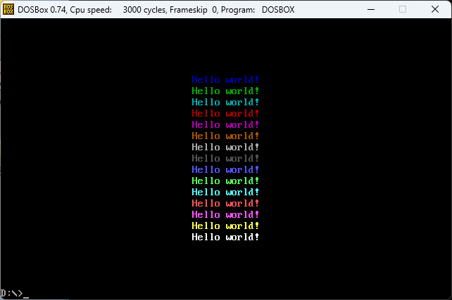

# Exercise 4 Screen Display

## 程序执行结果



## 汇编代码

```
.MODEL SMALL
.STACK 100h

.DATA
    Hello DB '                                  Hello world!'

.CODE
START:
    MOV AX, @DATA           ; 将数据段地址载入 AX 寄存器
    MOV DS, AX              ; 将数据段地址载入 DS 寄存器
    MOV AX, 0B800H          ; 将显存段地址（彩色文本模式）载入 AX
    MOV ES, AX              ; 将显存段地址载入 ES 寄存器

    CALL CLEAR_SCREEN       ; 调用子程序清屏

    MOV SI, OFFSET Hello    ; 字符串起始地址载入 SI
    MOV DI, 160 * 6         ; 设置显示位置为第 6 行
    MOV CX, 46              ; 字符串长度为 46 字节
    MOV BL, 1               ; 设置字符颜色（颜色代码 1）
    CALL DISPLAY_STRING     ; 调用子程序显示字符串

    MOV SI, OFFSET Hello
    MOV DI, 160 * 7
    MOV CX, 46
    MOV BL, 2               ; 设置字符颜色（颜色代码 2）
    CALL DISPLAY_STRING

    MOV SI, OFFSET Hello
    MOV DI, 160 * 8
    MOV CX, 46
    MOV BL, 3               ; 设置字符颜色（颜色代码 3）
    CALL DISPLAY_STRING

    MOV SI, OFFSET Hello
    MOV DI, 160 * 9
    MOV CX, 46
    MOV BL, 4
    CALL DISPLAY_STRING

    MOV SI, OFFSET Hello
    MOV DI, 160 * 10
    MOV CX, 46
    MOV BL, 5
    CALL DISPLAY_STRING

    MOV SI, OFFSET Hello
    MOV DI, 160 * 11
    MOV CX, 46
    MOV BL, 6
    CALL DISPLAY_STRING

    MOV SI, OFFSET Hello
    MOV DI, 160 * 12
    MOV CX, 46
    MOV BL, 7
    CALL DISPLAY_STRING

    MOV SI, OFFSET Hello
    MOV DI, 160 * 13
    MOV CX, 46
    MOV BL, 8
    CALL DISPLAY_STRING

    MOV SI, OFFSET Hello
    MOV DI, 160 * 14
    MOV CX, 46
    MOV BL, 9
    CALL DISPLAY_STRING

    MOV SI, OFFSET Hello
    MOV DI, 160 * 15
    MOV CX, 46
    MOV BL, 10
    CALL DISPLAY_STRING

    MOV SI, OFFSET Hello
    MOV DI, 160 * 16
    MOV CX, 46
    MOV BL, 11
    CALL DISPLAY_STRING

    MOV SI, OFFSET Hello
    MOV DI, 160 * 17
    MOV CX, 46
    MOV BL, 12
    CALL DISPLAY_STRING

    MOV SI, OFFSET Hello
    MOV DI, 160 * 18
    MOV CX, 46
    MOV BL, 13
    CALL DISPLAY_STRING

    MOV SI, OFFSET Hello
    MOV DI, 160 * 19
    MOV CX, 46
    MOV BL, 14
    CALL DISPLAY_STRING

    MOV SI, OFFSET Hello
    MOV DI, 160 * 20
    MOV CX, 46
    MOV BL, 15
    CALL DISPLAY_STRING

    MOV AX, 4C00h           ; 程序结束，返回 DOS
    INT 21h                 ; 调用中断退出

CLEAR_SCREEN PROC
    MOV DI, 0               ; 将 DI 设置为显存开始位置
    MOV CX, 4600            ; 显存区域共 2000 字（80*25），每个字 2 字节，共 4000 字节
    MOV AL, ' '             ; 用空格字符填充屏幕
    MOV AH, 0               ; 设置背景色为黑色
    CLD                     ; 清除方向标志，以便递增地址

CLEAR_LOOP:
    STOSW                   ; 将 AX 的内容（字符和颜色）存入显存
    LOOP CLEAR_LOOP         ; CX 减 1，如果不为 0，继续循环
    RET                     ; 返回到调用点

CLEAR_SCREEN ENDP

DISPLAY_STRING PROC
    PUSH AX                 ; 保存 AX 寄存器的值
    PUSH BX                 ; 保存 BX 寄存器的值

DISPLAY_LOOP:
    MOV AL, [SI]            ; 从字符串中取出一个字符
    MOV ES:[DI], AL         ; 将字符写入显存
    MOV ES:[DI+1], BL       ; 将颜色值写入显存
    INC SI                  ; SI 指向下一个字符
    ADD DI, 2               ; DI 指向显存的下一个字符位置（每字符占 2 字节）
    LOOP DISPLAY_LOOP       ; CX 减 1，如果不为 0，继续循环
    POP BX                  ; 恢复 BX 寄存器的值
    POP AX                  ; 恢复 AX 寄存器的值
    RET                     ; 返回到调用点

DISPLAY_STRING ENDP

END START
```

## 练习总结

* **汇编代码结构**：这段汇编代码使用了 8086 微处理器指令集，主要实现了在屏幕上多行显示“Hello world!”的功能，每一行使用不同的颜色。程序分为数据段、代码段以及两个子程序 `CLEAR_SCREEN` 和 `DISPLAY_STRING`。

* **数据段与变量定义**：在数据段中定义了字符串 `Hello`，包含内容为“Hello world!”。字符串前面留有空格，用于确保文本在特定位置开始显示。

* **显存初始化**：在代码段的开头，首先将数据段的地址加载到 `DS` 寄存器，并设置 `ES` 寄存器为显存地址 `0B800h`，用于在彩色文本模式下显示字符。

* **清屏功能**：通过调用子程序 `CLEAR_SCREEN` 来清空屏幕。该子程序将空格字符和黑色背景色填充整个显存区域，实现屏幕清空效果。循环设置 4000 字节，覆盖标准 80×25 的字符显示范围。

* **显示多行文本**：主程序依次调用 `DISPLAY_STRING` 子程序来显示字符串“Hello world!”。每次调用会更新 `DI` 寄存器，使文本显示在下一行，同时修改 `BL` 寄存器来设置不同的字符颜色。该过程将字符串显示在第 6 行到第 20 行之间，每行使用不同的颜色代码。

* **字符串显示子程序**：子程序 `DISPLAY_STRING` 使用 `SI` 和 `DI` 寄存器分别存放字符串起始地址和显存位置。每次循环从字符串中取出一个字符并显示在显存中，使用 `BL` 控制颜色。循环结束后恢复寄存器状态，返回主程序。

* **程序结束**：代码最后调用 `INT 21h` 中断，以返回 DOS 并结束程序运行。