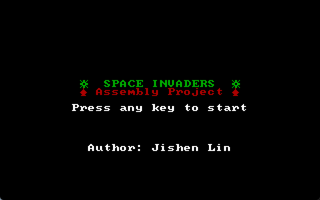
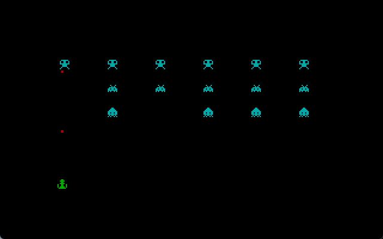
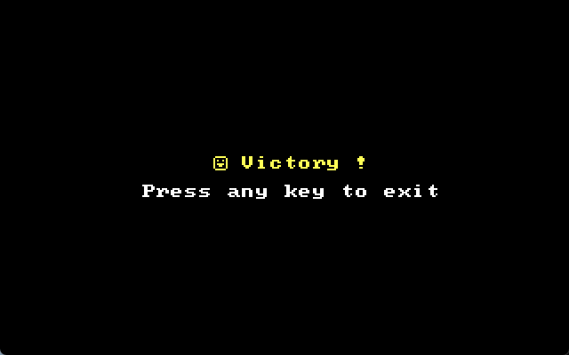

# Space Invaders

## 项目概述

本项目是一个基于 MASM（Microsoft Macro Assembler）汇编语言开发的经典游戏——**Space Invaders**。游戏的目标是控制一架英雄飞机，通过发射子弹消灭不断移动的敌机，最终清除所有敌机以获得胜利。游戏采用了 320×200 分辨率的图形模式，支持 16 种颜色，玩家可以通过键盘控制飞机的移动和发射子弹。

## 项目展示







## 项目功能介绍

### 游戏元素

* **英雄飞机**：玩家控制的飞机，位于屏幕底部，可以通过键盘左右移动。
* **敌机**：屏幕上方排列的敌对飞机，玩家需要通过发射子弹消灭它们。
* **子弹**：玩家发射的子弹，从英雄飞机的中间位置发射，向上移动，击中敌机后会消失。
* **碰撞检测**：子弹与敌机的碰撞检测，击中敌机后敌机消失。
* **游戏结束**：当所有敌机被消灭后，游戏结束并显示胜利信息。

### 游戏操作

* **左箭头键（4Bh）**：向左移动英雄飞机。
* **右箭头键（4Dh）**：向右移动英雄飞机。
* **空格键（20h）**：发射子弹。
* **'x' 键（78h）**：退出游戏。

### 游戏流程

* **初始化**：游戏启动时，进入图形模式，显示欢迎信息，等待玩家按任意键开始游戏。
* **游戏主循环**：
  * 绘制英雄飞机、敌机和子弹。
  * 更新子弹位置，检测子弹与敌机的碰撞。
  * 检测玩家按键，控制飞机移动或发射子弹。
* **游戏结束**：当所有敌机被消灭后，显示胜利信息，等待玩家按任意键退出游戏。

## 项目开发流程

### 开发环境

* **汇编语言**：MASM（Microsoft Macro Assembler）。
* **开发工具**：DOSBox、MASM 编译器、LINK 链接器。
* **目标平台**：DOS 操作系统。

### 项目结构

* **数据段（data segment）**：定义了游戏所需的所有变量和数据，包括英雄飞机的坐标、敌机的状态、子弹数组、敌机模型、游戏结束和开始时的提示信息等。
* **代码段（code segment）**：实现了游戏的初始化、主循环、绘制、更新、碰撞检测和按键处理等功能。

### 开发步骤

1. **初始化**：
   * 设置数据段寄存器（DS 和 ES）。
   * 进入图形模式（320×200，16 色）。
   * 显示欢迎信息，等待玩家按任意键开始游戏。
2. **模型处理**：
   * 将敌机模型的字符数据转换为颜色值，用于绘制像素。
   * 英雄飞机模型使用绿色，敌机模型使用青色。
3. **主循环**：
   * **清屏**：每次循环开始时，清除屏幕以准备绘制新画面。
   * **绘制元素**：
     * 绘制英雄飞机。
     * 绘制子弹（如果有）。
     * 绘制敌机（如果有）。
   * **更新元素**：
     * 更新子弹位置，检测子弹是否超出屏幕范围。
     * 检测子弹与敌机的碰撞，标记被击中的敌机为死亡状态。
   * **按键处理**：
     * 检测玩家按键，控制飞机移动或发射子弹。
     * 如果按下 'x' 键，退出游戏。
4. **游戏结束**：
   * 当所有敌机被消灭后，显示胜利信息，等待玩家按任意键退出游戏。

## 项目心得

### 汇编语言的挑战

汇编语言的开发与高级语言相比，具有更高的灵活性和性能，但同时也带来了更多的挑战。以下是我在开发过程中遇到的主要挑战：

* **手动管理内存**：汇编语言中没有自动内存管理机制，所有内存的分配和释放都需要手动完成。例如，在定义敌机和子弹的数据结构时，需要精确计算每个元素的内存占用，并确保内存不会溢出。这种手动管理的方式虽然繁琐，但也让我对内存布局有了更深入的理解。
* **图形模式的设置与操作**：在 DOS 环境下，图形模式的设置需要通过 BIOS 中断（如 `int 10h`）来实现。为了在 320×200 分辨率下绘制游戏元素，我需要直接操作显存（地址为 `0xA0000`）。这种直接访问硬件的方式让我深刻体会到了底层编程的强大能力，但也需要非常小心地处理像素数据的写入，避免越界或错误覆盖。
* **中断处理**：汇编语言中，中断是实现输入输出操作的核心机制。例如，通过 `int 16h` 中断读取键盘输入，通过 `int 10h` 中断绘制字符和像素。中断处理需要严格遵循硬件规范，稍有不慎就可能导致程序崩溃。在处理键盘输入时，我需要特别注意扩展键（如方向键）的两次扫描码读取机制，这增加了代码的复杂性。
* **碰撞检测的复杂性**：在游戏中，子弹与敌机的碰撞检测需要逐像素比较。由于敌机模型是 8x8 像素的，我需要遍历每个敌机的每个像素，并与子弹的坐标进行比较。这种逐像素的碰撞检测逻辑复杂且容易出错，需要反复调试和优化。

### 对堆栈的理解

在汇编语言中，堆栈是实现函数调用和局部变量管理的核心机制。通过本次项目，我对堆栈的理解更加深入：

* **函数调用与返回**：在汇编语言中，函数调用通过 `CALL` 指令实现，返回通过 `RET` 指令实现。每次调用函数时，当前的指令指针（IP）和可能的段寄存器（CS）会被压入堆栈，函数执行完毕后，堆栈中的值会被弹出，恢复到调用前的状态。
* **局部变量的保存**：在处理复杂逻辑（如碰撞检测）时，我需要保存多个寄存器的值（如 `CX`、`SI`、`DI` 等），以避免在函数调用过程中丢失数据。这些寄存器的值通过 `PUSH` 指令压入堆栈，使用完毕后再通过 `POP` 指令恢复。
* **堆栈的深度管理**：在嵌套调用和多层循环中，堆栈的深度会不断增加。为了避免堆栈溢出，我需要合理控制堆栈的使用，避免不必要的压栈操作。

### 模块化和代码复用

由于汇编语言没有类和对象的概念，封装主要体现在模块化和代码复用上：

* **模块化设计**：我将游戏的不同功能（如绘制、更新、碰撞检测等）拆分为独立的代码段，并通过跳转指令实现模块间的调用。这种模块化设计使得代码结构更加清晰，便于维护和调试。
* **代码复用**：在处理敌机和子弹的绘制与更新时，我抽象出了通用的逻辑，并通过参数传递（如寄存器传递偏移量）实现代码复用。例如，绘制敌机和绘制子弹的逻辑非常相似，我通过调整寄存器的值来复用绘制代码。
* **数据封装**：在数据段中，我将游戏元素（如敌机、子弹、英雄飞机）的数据结构定义为独立的变量，并通过偏移量访问这些数据。这种数据封装的方式使得代码更加简洁，避免了直接操作内存地址的复杂性。

### 对过程调用的理解

在汇编语言中，过程调用是通过 `CALL` 和 `RET` 指令实现的。通过本次项目，我对过程调用的理解更加深入：

* **参数传递**：在高级语言中，函数参数通过栈或寄存器传递。在汇编语言中，参数通常通过寄存器传递。例如，在绘制敌机时，我将敌机的坐标和模型索引通过 `AX`、`BX`、`CX` 等寄存器传递给绘制过程。
* **局部变量的保存与恢复**：在过程调用中，局部变量的保存和恢复是通过堆栈实现的。例如，在处理碰撞检测时，我需要保存当前的敌机状态和子弹状态，以避免在调用过程中丢失数据。
* **递归与嵌套调用**：虽然汇编语言中也可以实现递归调用，但由于堆栈深度的限制，递归调用需要非常小心。在本次项目中，我尽量避免使用递归，而是通过循环和跳转实现逻辑的重复执行。

### 对左右方向键的处理

在处理键盘输入时，方向键（如左箭头键和右箭头键）的扫描码需要特别注意。方向键属于扩展键，按下时会触发两次扫描码读取：

* **第一次扫描码**：按下方向键时，第一次读取的扫描码为 `00h`，表示这是一个扩展键。
* **第二次扫描码**：第二次读取的扫描码才是实际的方向键扫描码。例如，左箭头键的扫描码为 `4Bh`，右箭头键的扫描码为 `4Dh`。

在代码中，我通过以下逻辑处理方向键的输入：

```assembly
cmp al, 0       ; 检查是否为扩展键
jne key_left    ; 如果不是扩展键，跳转到普通按键处理
mov ah, 07h     ; 读取第二次扫描码
int 21h
```

这种两次扫描码的处理机制增加了代码的复杂性，但也让我对键盘输入的底层机制有了更深入的理解。

## 未来改进方向

* **增加敌机移动**：当前敌机是静止的，未来可以实现敌机的左右移动和向下移动。
* **增加分数系统**：记录玩家消灭敌机的数量，并在游戏结束时显示分数。
* **增加音效**：通过 PC 喇叭或声卡实现简单的音效，如子弹发射和敌机爆炸的声音。
* **增加难度**：随着游戏的进行，增加敌机的数量或速度，提高游戏难度。
* **支持更多按键**：增加对上下箭头键的支持，允许玩家控制飞机的上下移动。

## 项目总结

通过本次基于 MASM 汇编语言开发的 Space Invaders 游戏项目，我不仅掌握了汇编语言的基本语法和编程技巧，还深入理解了底层编程的核心概念和机制。汇编语言的开发过程充满了挑战，但也让我收获颇丰。首先，我学会了如何手动管理内存，通过定义数据结构（如敌机、子弹、英雄飞机），我精确计算了内存占用，并确保内存不会溢出，这种手动管理的方式虽然繁琐，但也让我对内存布局和数据结构有了更深入的理解。其次，在 DOS 环境下，我通过 BIOS 中断和直接内存访问实现了图形模式的设置与操作，学会了如何在 320×200 分辨率的图形模式下绘制像素，并直接操作显存（地址为 `0xA0000`），这种直接访问硬件的方式让我深刻体会到了底层编程的强大能力。此外，中断处理是汇编语言中实现输入输出操作的核心机制，通过 `int 16h` 中断读取键盘输入，通过 `int 10h` 中断绘制字符和像素，我学会了如何严格遵循硬件规范，避免程序崩溃。特别是在处理方向键的两次扫描码时，我体会到了键盘输入的底层机制。在项目开发过程中，我对堆栈操作、过程调用和代码复用有了更深入的理解。堆栈是实现函数调用和局部变量管理的核心机制，通过 `PUSH` 和 `POP` 指令，我学会了如何在函数调用过程中保存和恢复寄存器的值，避免数据丢失。同时，我也意识到堆栈深度的管理非常重要，避免堆栈溢出是开发中需要特别注意的问题。汇编语言中的过程调用通过 `CALL` 和 `RET` 指令实现，通过将游戏的不同功能（如绘制、更新、碰撞检测）拆分为独立的过程，我实现了代码的模块化和复用。例如，绘制敌机和绘制子弹的逻辑非常相似，我通过调整寄存器的值来复用绘制代码。然而，碰撞检测的实现是项目中最具挑战性的部分，由于敌机模型是 8x8 像素的，我需要逐像素比较子弹与敌机的坐标，这种逐像素的碰撞检测逻辑复杂且容易出错，需要反复调试和优化。通过本次项目，我不仅提升了汇编语言的编程能力，还加深了对计算机底层原理的理解。汇编语言的开发虽然充满挑战，但也让我体会到了直接操作硬件的乐趣。未来，我计划在现有项目的基础上增加更多功能，如敌机的移动、分数系统、音效等，进一步提升游戏的趣味性和挑战性。同时，我也会继续探索汇编语言的更多特性，开发更加复杂和有趣的项目。总的来说，本次 Space Invaders 游戏项目是一次非常宝贵的学习经历，让我深刻体会到了计算机硬件与软件之间的紧密联系，也让我更加坚定了深入学习底层编程的决心。